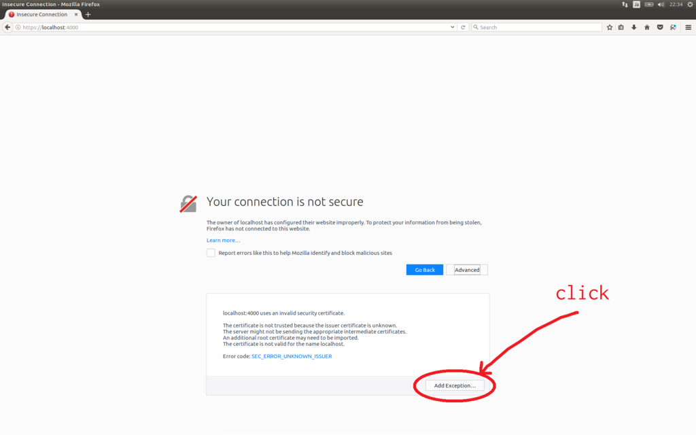
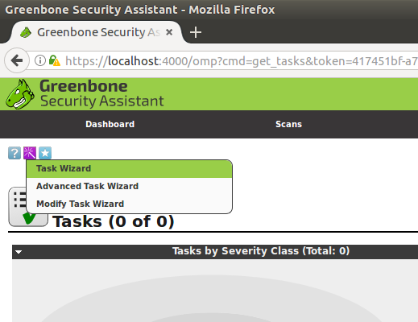
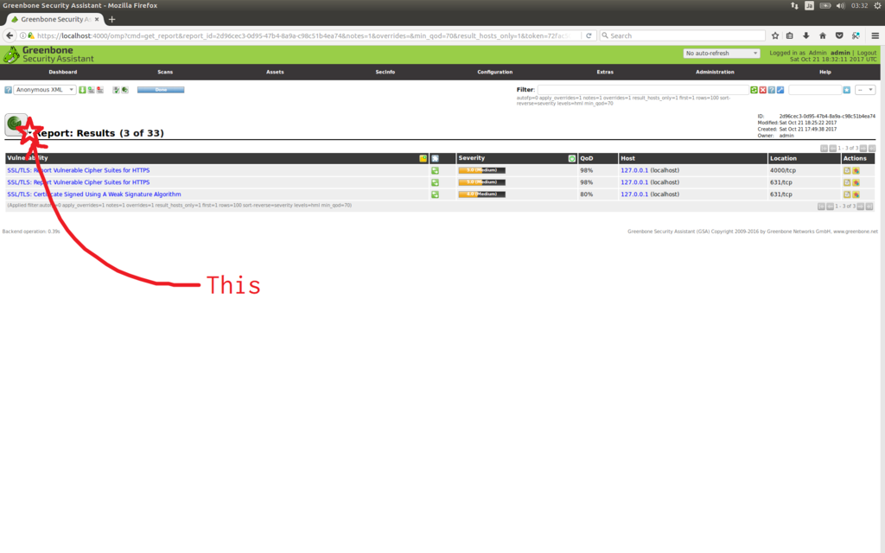

今回は、OSSの脆弱スキャナであるOpenVASをUbuntu16.04LTSでいい感じに使えたので、まとめた。  
脆弱性スキャナという単語に対し、「ムズカシイ」というイメージを持っていたが、意外と簡単に使えて驚いた。  

> **OpenVASとは**
>
> > OpenVASとは、システムの脆弱性診断を行うためのソフトウェアです。
> > オープンソースソフトウェアとして公開されています。
> > そのため、OpenVASを使うと、脆弱性診断サービスなどを使わなくても、自分でシステムの脆弱性診断を行うことができます。
>
> 引用: <https://www.designet.co.jp/faq/term/?id=T3BlblZBUw> より

## 1.環境

使用する環境は、以下の通り。

```shell-session
$ lsb_release -a
No LSB modules are available.
Distributor ID: Ubuntu
Description:    Ubuntu 16.04.3 LTS
Release:    16.04
Codename:   xenial

$ uname -r
4.8.0-36-generic
```

## 2.インストール

インストールは、[ここ](http://blog.amedama.jp/entry/2017/08/09/004706)を参考にした。  

以下のコマンドを上から順に実行していけば、インストールが完了する。  
まるごと貼り付けても動くが、心配であればひとつずつ実行していくと良いだろう。  

**(注意) tcpの873ポートで通信ができるようにしておくこと。[^1]**

```sh
# 必要なリポジトリを追加する
yes | sudo add-apt-repository ppa:mrazavi/openvas

# リポジトリの状態を更新する
sudo apt-get update

# oepnvas9をインストールする
sudo apt -y install openvas9
```

インストール中に、下の画像のような画面が出てきた場合は、「Yes」と答える。

  

次に、脆弱性のテスト時に使用するデータを更新する。  
この処理は、30分～1時間ほど時間がかかる。

```sh
sudo apt -y install sqlite3
sudo greenbone-nvt-sync
sudo greenbone-scapdata-sync
sudo greenbone-certdata-sync 
```

## 3.実際に脆弱性スキャンしてみる

インストールが完了したら、実際に脆弱性スキャンをしてみる。  

### 1.事前準備

まずは、サービスを起動する。

```sh
sudo systemctl restart openvas-scanner
sudo systemctl restart openvas-manager
```

次に、OpenVASのデーモンの設定を初期化しておく。

```sh
sudo openvasmd --rebuild --progress
```

### 2.WebUIにアクセスする

事前準備が完了したら、localhostの4000番ポートでWebUIが利用できるようになる。  
実際に利用するには、任意のブラウザで「<https://localhost:4000>」にアクセスする。  
今回は、Firefoxを利用する。  

実際にアクセスすると、下の画像のように、安全な接続ではないという旨の画面が出てくることがある。  
その場合、次の手順で進む。  
(出てこない場合は、次の手順は飛ばして良い。)  


①「Advanced」の箇所をクリック  


②「Add Exception...」の箇所をクリック  



③「Confirm Security Option」の箇所をクリック


すると、ログイン画面が出てくるので、デフォルトのIDとパスワードでログインする。  
デフォルトのIDとパスワードは、それぞれ`admin`。[^2]

  

ログインすると、このような画面になる。


### 3.脆弱性スキャンを実行する

WebUIにアクセスすることができ、ログインが済んだら、実際に脆弱性スキャンを実行する。  

> [注意]  
> **脆弱性スキャンは、自身の管理下にないコンピュータやネットワークに対して、決して実行しないこと。実行した場合には、罪に問われる可能性もある。**

今回は、自身(localhost)に対してスキャンを実行する。  
手順は以下の通り。  

①上のメニューから`Scans`を選び、その中の`Tasks`をクリックする。


②以下のような画面が出てきたら、10秒間待つか、ダイアログの[x]を押して閉じてしまう。  
出てこなければ、この手順は飛ばす。  


③左上の方の紫色のボタンを押し、`Task Wizard`をクリックする。[^3]  
紫のボタンの位置はは少しわかりづらいので、画像を参考にすると良い。  




⑤すると、下の画像のような画面が出てくるので、`IP address or hostname`のフォームに`localhost`または`127.0.0.1`と入力する。  
入力したら、`Start Scan`をクリックすることで脆弱性スキャンが実行される。  


⑥下の画像のような画面になるので、`Status`の欄が`Done`になるまで待つ。  
`Done`になったらスキャン終了。  


## 4.スキャン結果を確認する

脆弱性のスキャンが終わったので、その結果を確認する。  
手順は、以下の通り。  

①上のメニューから`Scans`を選び、その中の`Reports`をクリックする。  


②下の画像のような画面になるので先ほどスキャンした日付のものを選択する。  


以上の手順で、下の画像のようにスキャンの結果のレポートが閲覧できる。


また、スキャン結果は分類されており、その各項目別の閲覧ができる。  

レーダーのようなマークの横にある小さな▼にカーソルを合わせると、分類されたスキャン結果の各項目が選択できる。  
例によって、少しわかりづらいので図示する。



各項目を選択することで、その項目のスキャン結果が閲覧できる。


## 5.スキャン結果をエクスポートする

スキャン結果は、htmlやpdf等の様々なファイル形式でエクスポートすることができる。  
今回は全体のスキャン結果をHTML形式でエクスポートする。  

手順は以下の通り。

①まずは、レーダーのようなマークの横にある小さな▼にカーソルを合わせ、`Report: Summary and Download`を選択する。


②次に`Full report`の行にあるプルダウン形式のメニューでエクスポートしたいファイル形式を選択する。  


③そして、プルダウン式のメニューの横にある緑色の[↓]ボタンをクリックする。これにより、指定したファイル形式でスキャン結果がエクスポートされる。  


④この後は、普段何かをダウンロードするときと同じように`Save File`を選択し`OK`と進めば、エクスポートされたスキャン結果をダウンロードすることができる。  


今回はHTML形式でエクスポートしたものをダウンロードしているので、ダウンロードしてきたファイルを任意のブラウザで開けば、実際のスキャン結果が確認できる。  

## 6.まとめ(感想)

実際に脆弱性をスキャンしてみると、いくつかの脆弱性が見つかった。  
スキャン結果には、攻撃者がその脆弱性を利用すると、どのようなことができてしまうのかということや、それに対する解決策などが書かれていた。  

スキャン結果に、一通り目を通してみたが、おそらくメジャーであろう脆弱性についても自分では発見することはできないなと感じた。  
Webの脆弱性について(もちろんそれ以外の分野も)、まだまだ基礎の勉強が足りてないなと痛感した。  

今回はUbuntu16.04でOpenVASを使ったが、どうやらKali Linuxには最初からインストールされているようで、Ubuntuを使うよりもっと簡単に使えそう。  
今回Ubuntuを使ったのは、普段使い慣れたOSだからだ、「Kaliでやれよ」という声は/dev/nullに捨てることにしている。  

他の脆弱性スキャナでは、Nessusなども一応使うことができたが、Vulsは環境構築でハマってしまっている。  

がんばる

## 参考ページ

- <http://blog.amedama.jp/entry/2017/08/09/004706>
- <https://www.designet.co.jp/faq/term/?id=T3BlblZBUw>  
- <http://olivermarshall.net/how-to-install-openvas-9-on-ubuntu-16>  
- <https://www.itseclab.jp/security_info/security_intro/openvas_verification>

## 注釈

[^1]: インストールの過程で、脆弱性をテストするための情報を更新する。その処理のために、rsyncプロトコルを使用するため。
[^2]: 変更する際は、`sudo openvasmd --user=admin --new-password=admin_new_password`をターミナルで実行する。
[^3]: ここで「Advanced Task Wizard」を選ぶと、より詳細な脆弱性スキャンができる
