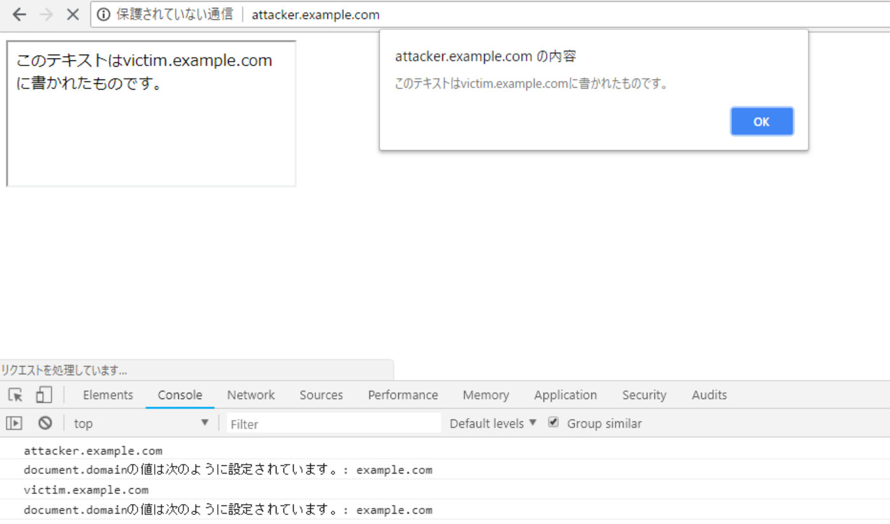

## はじめに

`document.domain`に関わる面白いSOPバイパスの手法を検証した。

## 概要

`document.domain`は古くからSOPを緩和するために使われてきたようだ。
例えば、同じ親ドメインを持つ2つのオリジン(例: `foo.exapmle.com`と`bar.example.com`)があり、SOPに縛られることなく互いに通信を行いたいとする。このとき、双方で`document.domain`の値に`example.com`を設定することで、2つのドメインは互いのDOMにアクセスすることができるようになる。
今回検証したバイパス手法は、この挙動を利用したものである。

## 条件

以下の条件を満たしているとき、SOPをバイパスできる。

1. 対象のページのdocument.domainが上位ドメインに設定されている
2. 問題のあるページのサブドメインのコンテンツをクライアント側で制御できる

## 検証

まず、被害者のサイトに見立てて、以下のような`victim.example.com`というページを用意する。

```html
<!-- victim.example.com -->
<meta charset="utf-8">
<script>
    console.log(document.domain);
    document.domain = "example.com";    // vuln
    console.log("document.domainの値は次のように設定されています。: " + document.domain);
    document.write("このテキストはvictim.example.comに書かれたものです。");
</script>
```

このコードでは、5行目で`document.domain = "example.com"`としている。
そのため、攻撃者の用意する以下のような`attacker.example.com`で同様に`document.domain = "example.com"`とすると、攻撃者のページからも`victim.example.com`のDOMへのアクセスが可能になる。
攻撃の成立にはサブドメインのコンテンツを制御できる必要があるが、一般的な例ではSubdomain Takeoverでそれが可能になる。

```html
<!-- attacker.example.com -->
<meta charset="utf-8">
<script>
    console.log(document.domain);
    document.domain = "example.com";
    console.log("document.domainの値を次のように設定します。: " + document.domain);
</script>
<iframe src="http://victim.example.com/" onload="alert(contentDocument.body.innerHTML)"></iframe>
```

実際に`attacker.example.com`にChromeでアクセスすると、`victim.example.com`のページの内容を`attacker.example.com`から取得できていることが確認できた。



## 脅威

検証では、`attacker.example.com`から`victim.example.com`の内容を読み出せた。
もし、FacebookやTwitterなどに同じ問題(バグ)があった場合には、ユーザのメッセージやその他の情報を読み出される可能性がある。
また、`document.domain`に最上位ドメインである`com`や`org`などが設定されている場合には、`victim.example.com`に対して、例えば`evil.com`からの攻撃が可能になる。なお、現在は`document.domain`に最上位ドメインを設定できる主要ブラウザはSafariのみで、その他の主要ブラウザではエラーになる。(詳細: [https://hackerone.com/reports/398163/])

## まとめ

上位ドメインを共有する2つのオリジンのdocument.domainに、共有している上位オリジンを設定すると双方のDOMにアクセスできるようになる。
これを利用して、問題のあるページのサブドメインのコンテンツをクライアント側で制御できるとき、SOPをバイパスしてそのページのコンテンツにアクセスすることが可能になる。また、サブドメインのコンテンツをクライアント側で制御できるようにする方法としてSubdomain Takeoverが挙げられるが、主要ブラウザの中でSafariのみは`document.domain`に`com`や`org`などの最上位ドメインを設定できるため、Subdomain Takeoverが不要なケースがある。

## 感想

このネタはTwitterで見かけたもので、検証が簡単だったので記事にしました。
(HackerOneで公開されたレポートは追うようにしているけど、今回の記事に関連するfiledescriptor氏の[レポート](https://hackerone.com/reports/398163)は見落としてしまっていたなあ...。)
書き終わってから思ったのですが、2つのオリジンで`document.domain`の値を変更して同一オリジンにしてるのを、SOPのバイパスと呼んで良いものか微妙ですね。

あと、Safariでは`document.domain`に最上位ドメインを設定できるってところ、実はMacを持っていないのでWindows版Safari(バージョン5.1.7)でしか検証できていません。
もし、最新版のMacで検証した人がいたら、結果を教えていただけたら幸いです。
Mac買いたいなあ...。

## 参考資料

- [Bypassing Same-Origin-Policy - document.domain](https://www.aa7ifs.com/bypassing-same-origin-policy-using-document-domain/)
- [https://hackerone.com/reports/398163](https://hackerone.com/reports/398163)
- [クロスドメイン制約 を document.domain の 変更 で 回避 - galife](https://garafu.blogspot.com/2013/09/documentdomain.html)
