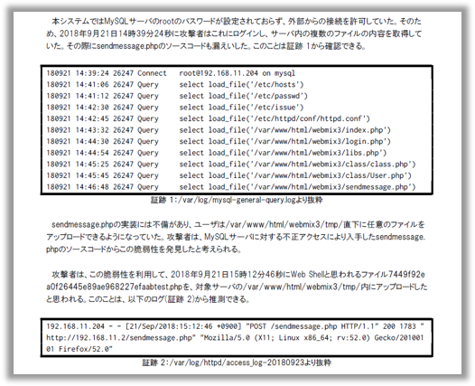

こんにちは、[8ayac](https://twitter.com/8ayac)です。先日、[MBSD Cybersecurity Challenges 2018](http://setten.sgec.or.jp/cooperation/060.html)というコンテストで優勝しました。[去年](https://twitter.com/8ayac/status/940922733088555008)に続き2年連続の優勝です。

この記事では、前述のコンテストの予選から最終審査会までの色々を書きたいと思います。

## 目次

[:contents]

## コンテストについて

コンテストの概要は、[こちら](http://setten.sgec.or.jp/cooperation/060.html)のページに全て載っているので、必要に応じて参照して下さい。この記事では、競技内容に焦点を当てた紹介をしておこうと思います。

### テーマ

テーマは、「フォレンジック調査」でした。コンテストの設定は、公式に書かれている通りです。(以下参照)
> ある会社で開発したSNSのシステムにセキュリティ上の問題があると指摘されていたにも関わらずそのまま運用を続けていたところ、何者かに攻撃されてしまったようです。
> あなたのチームは、攻撃の全貌を解明できるでしょうか。

### 競技内容

このコンテストには、一次審査と最終審査があります。一次審査では、攻撃を受けたWebサイトのシステムと改ざんされる前のWebアプリケーションのソースコードを元に、「どのような攻撃を受けたか」「影響範囲はどのくらいか」を調査し、そのレポートを提出します。レポートを提出する相手には、攻撃を受けたWebサイトを運営する企業を想定するみたいでした。そして、一次審査で優秀なレポートを提出した上位10チームが最終審査会に進み、一次審査で提出したレポートに関する内容でプレゼンを行います。そのプレゼンと、一次審査のレポートに対する審査の総合点で最終的な順位が決定されます。

### 大会期間

大会期間は、以下の表の通りです。

| 内容                  | 期間                              |
| --------------------- | --------------------------------- |
| チームエントリー受付  | 2018年10月10日(水)～11月20日(火)  |
| 課題配布              | 2018年10月22日(月)～11月20日(火)  |
| レポート提出期限      | 2018年11月20日(火)                |
| 一次審査結果発表      | 2018年11月27日(火)                |
| 最終審査会            | 2018年12月12日(水)                |

課題配布期間内であれば、チームエントリーが済んだチームから課題が配布されます。課題の配布が始まる前にチームエントリーを済ませておけば、一次審査のレポート作成には最大で約一ヶ月ほどを充てることができます。最終審査会は一次審査の結果発表から約二週間後に行われます。

### 審査観点

審査観点については、公式のものを引用します。
以下のような審査観点に基づいて、レポートやプレゼンが採点されるようでした。

> #### 攻撃に使われた脆弱性
>
> どのような脆弱性を使って、どのような手順で攻撃を行ったのかがわからないと、サイト復旧後もまた同じ被害を受けます。(攻撃に使われなかった脆弱性は様々ありますが）まず何から対策に着手すれば良いのかの判断にも重要な情報です。
>
> #### 被害の範囲
>
> どのようなデータがどのくらい、漏えいや破壊がされたのかわからないと、事業に与えるインパクトが判断できません。またもしサイト利用者のデータに被害が及んでいる場合は、利用者に対して謝罪をする必要があるかもしれません。
>
> #### 対応方法
>
> 被害を受けた会社は今パニックになっているでしょう。直近で行うべき暫定対策や、長期的に取り組む恒久対策など、対応方法を提案してください。
>
> #### 調査で行った工夫
>
> ツールを使った・作った、チームメンバーの役割分担、調査手法など、解析を網羅的・効率的に実施するために行った工夫があれば、ツール名やソースなど具体的に記載しアピールしてください。

## 予選(一次審査)に関すること

### 気合

何事も「気合」が大事だというのが、文化系に見えてゴリゴリの体育会系である私達のサークルの教えです。2連覇を狙っていました。我々のチームは、部室で「優勝する人！」と言って手を挙げた人達同士で組んだチームです。同じ学校から出たMOFFU_MOFFU_ISCにも挙手していた人はいましたが、私達のチームは全員が「優勝する」と宣言したチームだということもあり、負けるわけにはいきませんでした。大会期間中、各チームの気合で満ちた部室は殺伐としていました。

### 調査の進め方

調査は、基本的には、各々の技術や知識に依った調査をバラバラに進めていき、それをスプレッドシートにまとめていくという進め方をしていました。そして、そのスプレッドシートを基にチームで疑問点などを解消していくことで、攻撃の全貌を明らかにしていきました。調査期間には一次審査で使える時間の約三分の二を費やし、残りの時間でスプレッドシートの内容を基にレポートを作成しました。

役割分担は、概ね以下の通りです。各人が以下に書かれている作業以外もしていますが、ここでは「主に担当した作業」についてまとめています。

- [@8ayac](https://twitter.com/8ayac)
  - チームリーダー
  - 攻撃者的な視点での作業全般
  - 攻撃の検証方法作成
  - 不足している証跡等の洗い出し
  - 自然言語担当(レポート作成)
- [@iria_piyo](https://twitter.com/iria_piyo)
  - フォレンジックのプロ
  - ファイル系の調査
  - タイムスタンプの紐づけ
- [@mnao_305](https://twitter.com/mnao_305)
  - 対策は俺に任せろ
  - 一般的な調査作業
- [@somebody_gp](https://twitter.com/somebody_gp)
  - ツールを使ったマルウェアの検出
  - ツールを使ったログ解析
  - 被害範囲の列挙

私達のチームは、Blue寄りの人間が多かったので、私は攻撃者的な観点から調査を支援していました。自己評価ですが、各々の知識や技術に依った調査が行き詰まってきた終盤で、かなり威力を発揮できたと思います。終盤では、その時点で出揃っている証跡を一つ一つ吟味して、攻撃の成功の可否や再現を行い、「こんな証跡があったら嬉しい」という情報を他のBlueなメンバーに渡して調査してもらいました。そして、その調査結果をまた吟味して、以降ループといった感じに調査を進めました。初めからこの手法で調査を進められていれば、もう少し余裕を持ってレポートの作成に移れたと思います。

### 正確性と詳細さ

個人的に、大会の公式ページに書かれていた「あなたのチームは、攻撃の全貌を解明できるでしょうか。」という一文に対して闘争心を強く持っていました。チームとしても、その思いは強く、全員が「必ず攻撃の全貌を明らかにする」という闘争心をメラメラと燃やしていたと思います。

攻撃の全貌を解明したことを示すために、レポートの内容は詳細に書くように心がけました。具体的には、以下の情報を載せるようにしました。

- 確認した事象
- 事象の発生日時
- 確認した事象の検証方法(再現方法)
- 裏付けとなる証跡

正確性にもこだわりました。その理由は「フォレンジックだから」と言ってしまえばそれまでなのですが、個人的な理由としては、去年の大会で「誤検知が多い」という酷評を受けていたからです。今年は、非の打ち所がないような報告書を提出しようと心に決めていました。他にも、正確性の観点でいえば、言葉の表現が厳密になるように気をつけました。例えば、確認できた事象が「明らかなこと」か「推測されることか」を適当に区別していました。

実際のレポートの雰囲気はこんな感じです。

### OSINT(?)

最終審査会で審査員の方がお話していたことによれば、今回の一次審査の課題として配布されたシステムは、二年前に開催された[MBSD Cybersecurity Challenges 2016](http://setten.sgec.or.jp/cooperation/037.html)のシステムとほぼ同じものでした。そのことは、過去の大会の情報は収集していたので「もしかしたら、これ同じかも...?」ぐらいの見当は付けていましたが、我々のチームのメンバーに2年前の大会に参加していた人が誰もいなかったので、確信は持てていないような状態でした。

過去の課題と同じシステムであれば、インターネットに落ちている過去の大会の情報が調査の役に立つかもしれないと考え、実際にはMBSD Blogの[過去記事](https://www.mbsd.jp/blog/20161222.html)などを参考にしました。とはいえ、実際に参考にした時点では、今回の大会でもDirty COWやSQLiなどの脆弱性が使われていたことは知っており、ほとんどの内容は既知のものでした。この記事を読んで気づいたことといえば、Heart Bleedの脆弱性が今回の調査対象のシステムにも残っていたことぐらいです。しかし、実際に攻撃されたと思われる証跡は確認できず、実際のレポートでは、考察の章の中で以下のように少し触れる程度にしておきました。

> 今回の解析ではHeartbleedの脆弱性を悪用した攻撃の証跡を確認することができなかったがHeartbleedを悪用した攻撃ではそもそも証跡が残らないため、実際にはこの脆弱性を悪用した攻撃が行われていた可能性がないとは言い切れない。[^1]

### 工夫点

我々は対象のVMの調査を行う上で、FTK Imagerというツールを利用していました。これを利用すると、様々な恩恵があります。デジタルフォレンジックでは定番のこのツールですが、実際に使ったチームはとても少なかったらしく、「アピールしていれば、もう少し点数高かったのかな。」という講評をいただき、とても悔しい思いをしました。このツールを使ったことがアピールできる「工夫」だという認識はなかったので、その話を聞いたときにはとても意外でした。

私達のチームは、当初はApacheLogViewerやSplunkなどを用いて調査を行っていましたが、途中からはgrep、awk、sort、cut、sedなどのUNIXコマンドを用いて愚直に調査を行っていました。課題のログの分量と提出までの期間を考えても、十分だったと思っています。もっと大量のログであれば、ログ解析ツールなどを使って本格的に調査を進めた方が良かったかもしれません。同じ学校から出ていた別のチームのMOFFU_MOFFU_ISCは、ELK Stackを用いた解析を行っていて、かっこいいなと思いました。([MOFFU_MOFFU_ISCの記事](https://azara.hatenablog.com/entry/2018/12/14/110104))

## 本戦(最終審査会)に関すること

### 発表内容に関する考察

最終審査会での発表内容には毎年悩まされます。
最終審査会の審査観点も前述の四点だとすると、全てを盛り込んで十二分で喋るというのが難しいなと感じます。
他のチームはうまくやっていて、特に「NEthernet Ⅱ」さん(東北電子専門学校のチーム)の発表が上手に作られているなと感じました。
そのチームの発表では、最終的に今後の対応を提案する対象である経営層に合わせて、技術的な発表を避けて図や表を多く使用して事実(実際に攻撃に使われた脆弱性/被害範囲)に関する説明を端的に終えていました。
そして、残った時間で本題である対応方法の提案をしっかりと伝えており、その内容も説得力があって関心しました。
対応方法に関する質問にも、落ち着いて、説得力のある回答をされていたのが印象的です。
「NEthernet Ⅱ」さんの発表の点数は「表示エラー」さんのチームと同点で一番高かったのですが、発表内容には「調査で行った工夫」に関することは含まれていなかったので、必ずしも審査観点の全てを、発表内容に盛り込む必要はないのかもしれません。

### IPFactoryの発表内容

私達のチームの発表のテーマは、「正確な原因究明には多くの証拠が不可欠」というものでした。大筋は、「ログやその他の証拠が十分に取れていないと、誤検知や見逃しが発生する可能性があります。
さらには、それに気づかない可能性もあるので、ログやその他の証拠は普段から十分に集めておくことが重要です。
今後は証拠収集のポリシーやルールの策定を検討する必要があると思いますが、いかがでしょうか。」といった内容です。

結果としては、コケたなという印象です。事実、発表の点数は下から二番目でした。色々反省があるのですが、全体的に説得力のない発表内容になってしまったなという感想です。

### 発表スライド

実際の発表スライドは[こちら](https://speakerdeck.com/8ayac/mbsd-cybersecurity-challenges-2018-zui-zhong-shen-cha-hui-fa-biao-suraido)

## 大会を振り返って

まず、何よりも、やはり優勝できて嬉しい。去年も優勝したが、当時は先輩に頼りきりだったので、今年は自分たちの力で優勝を勝ち取れたことが何よりも嬉しい。
また、去年は「誤検知が多い」と酷評を受け、とても悔しかったが、今年は「一番精度が高かった」と好評をもらえて嬉しい。
しかし、「ほぼ真相を解明できていた」という好評を受けた一方で、一点の間違いがあったことが悔しい。
なぜ、その点を見落としたのか、その原因をよく考察して次回以降に繋げたいと思う。

次に、DFIRをテーマにした今回のコンテストに取り組んでみて変化した自身の心境についてだが、このコンテストを通じてBlueな観点からの情報セキュリティにも非常に興味を惹かれた。
攻撃者の悪意を持った行動を辿る楽しさには、こういう機会でもなければ気づかなかっただろうと思う。
攻撃者の行動を辿る中で、徐々に真実が解明されていくパズルを解いているような感覚がとても気持ち良かった。
また、今回のチームでは攻撃者的な視点の私と他の防御側視点のチームメンバーの間で、お互いに気づかないことを共有できたことで、情報セキュリティをやっていく上でRedとBlueの視点のどちらも必要であることを肌で感じる事ができたのは良い経験だと思う。
これからは、極端にRedに寄らず、Blue的な観点も持つことが重要だと感じた。

最後に、今回の優勝は、チームで勝ち取ったものだと思う。
誰か一人でも欠けていれば、優勝はできていなかっただろうと心から思う。チームメンバーに謝辞を述べたいところではあるが、最近Twitterで、謝辞はビッグバンに対して述べると良いらしいということを知った。
ということで、ありがとうビッグバン。

## おまけ

<blockquote className="twitter-tweet">
    

        MBSD Cybersecurity Challenges 2018で優勝しました。2連覇です！😎😎 <a href="https://t.co/bWSVAkIhLc">pic.twitter.com/bWSVAkIhLc</a>
    

    &mdash; 8ayac(Yoshinori Hayashi) (@8ayac) <a href="https://twitter.com/8ayac/status/1072787615525392384?ref_src=twsrc%5Etfw">December 12, 2018</a>
</blockquote>

## 実際に提出したレポート(2019/01/14 追記)

私達のチーム(IPFactory)が提出した[レポート](https://drive.google.com/file/d/1TqSTRwXYYWOqvguZ-Y2CxOxAb3iy_Slx/view)を公開しました。
今回の大会の成果物は、共有することに大きな意義があると考えました。
私達の公開したレポートが、今回の大会に参加していた学生の方々や、その他の様々な方のお役に立てれば幸甚の至りです。

<iframe src="https://drive.google.com/file/d/1TqSTRwXYYWOqvguZ-Y2CxOxAb3iy_Slx/preview" width="450" height="625"></iframe>

## 注釈

[^1]: 実際のレポートより抜粋: 考察の章の中でHeart Bleedを悪用した攻撃の可能性について触れている部分
