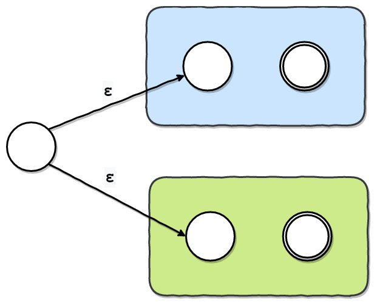
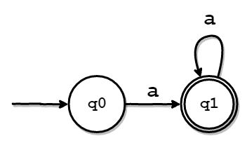

🎄**本記事は[IPFactory Advent Calendar 2019 - Qiita](https://qiita.com/advent-calendar/2019/ipfactory)16日目の記事です**🎄

こんにちは、[8ayac](https://twitter.com/8ayac)です。
最近、正規表現エンジンをGoで実装したので、その話を書きました。

## 正規表現エンジンとは

正規表現エンジンとは、正規表現のマッチングを行う処理系のことです。
正規表現エンジンは、DFA型とVM型という2つのタイプに分けられます。
各エンジンの特徴は、およそ以下の通りです。

- DFA型
  - 正規表現を、DFA(決定性有限オートマトン)に変換して、マッチングを行う。
- VM型
  - 正規表現を、バイトコードに変換して、マッチングを行う。

今回は、どちらのエンジンも実装したので、両方書こうと思っていたのですが、想定していたよりもかなり分量が多くなってしまったので、今回はDFA型のエンジンについてのみ書こうと思います。

## 正規表現とは

では、正規表現とは何でしょうか。
正規表現は、「文字列のパターンを表す式(表現)」です。
もとは、数学的な概念で、厳密に定義されていますが、この記事の趣旨と少し離れてしまうため、本記事では割愛します。
詳しく知りたい人は、[正規表現 - Wikipedia](https://ja.wikipedia.org/wiki/%E6%AD%A3%E8%A6%8F%E8%A1%A8%E7%8F%BE)を読むといいと思います。

厳密な正規表現の定義では、和集合(選択)/連接/繰り返しの規則が利用できます。
これらのルールは、例えば、一般的に以下のように表されます。

- `a|b`
  - `a`か`b`というパターン
- `ab`
  - `a`の直後に`b`が来るようなパターン
- `a*`
  - `a`が0回以上繰り返されているパターン

今回は、これらの基本のルールを使えるような正規表現エンジンを実装しました。

## DFA型正規表現エンジン

DFA型の正規表現エンジンは、一般的に、およそ以下の流れでパターンマッチングを行います。

1. 正規表現からNFAに変換
2. NFAをDFAに変換
3. DFAのシミュレートを実行

このあとは、有限オートマトンについて軽く説明したあと、それぞれの工程について、もう少し掘り下げて説明します。

### FA(Finite Automaton:有限状態機械)について

有限オートマトンとは、大まかにいえば「文字列のパターンマッチングを行う計算モデル」です。
1つの状態(現在の状態)と遷移規則という2つの情報を保持しており、文字列が入力された際に、初期状態という状態から、その遷移規則に基づいて現在の状態を更新していきます。
そして、最終的な状態が受理状態だった場合に、「受理」という結果を返します。もし、そうでなければ、「拒否」という結果になります。

以下の図は、`a`という文字を受理するシンプルなオートマトンを表しています。


上のオートマトンの構成要素は、以下の通りです。
受理状態は、慣例的に枠線を二重にして表します。

- 初期状態
  - q0
- 受理状態
  - q1
- 遷移規則
  - q0のときに`a`を受け取ったら、q1に状態を更新する。

例えば、このオートマトンに`a`という入力を渡すと、状態は`q0→q1`と変化します。このとき、現在の状態は受理状態であるため、`a`という入力が「受理された」ということになります。

NFAやDFAなどの有限オートマトンは、正規表現(厳密に言えば正規言語)を認識できる計算モデルです。
また、任意の正規表現から、等価なオートマトンを作れることが知られています。
このような性質を利用すると、任意の正規表現から等価なオートマトンを作り、シミュレーションを実行することでマッチングを行えます。
これが、DFA型の正規表現エンジンの仕組みです。

### NFAとDFAの違い

NFAとDFAの違いについても簡単に説明します。
以下の通りです。

- DFA(Deterministci Finite Automaton)
  - 決定性有限オートマトン
  - あるシンボル(記号)を受け取ったときの遷移先が一意
- NFA(Non-Deterministic Finite Automaton)
  - 非決定性有限オートマトン
  - あるシンボル(記号)を受け取ったときの遷移先が1つ以上(一意でない)

つまり、NFAは有限オートマトンの総称で、DFAはNFAに包含されています。
ちなみに、NFAからは、非決定性(遷移先が一意に定まらない性質)を取り除くことができます。
要するに、任意のNFAをDFAに変換することができるということです。
非決定性を取り除く方法の詳細は、後述します。

## 正規表現をNFAに変換

DFA型の正規表現エンジンでは、まず正規表現をNFAに変換します。
正規表現をNFAに変換するまでの流れは、大きく以下の2つの段階に分けられます。

1. 正規表現からASTを構築
2. ASTからNFAを構築

もう少し、細かく分けるとすれば、以下のような感じでしょうか。

1. 字句解析でトークン列を取得
2. トークン列をもとに構文解析を行いASTを取得
3. ASTからNFA Fragmentを取得
4. NFA FragmentをNFAに変換

ここからは、各工程の詳細について説明します。

### 正規表現からASTを構築(コンパイル)

正規表現からNFAを構築するにあたり、正規表現の文字列(例えば`a*`や`b|c`)をより扱いやすい形式に変換する作業が必要です。
より扱い形式というのがAST(抽象構文木)で、これを構築する処理をコンパイルと呼び、その処理を行うプログラムをコンパイラと呼びます。

コンパイラの部分の解説をしようとすると、やや本筋から逸れるので、本記事では、あまり詳細な説明は省きます。
DFA型のコンパイラの実装については、[この記事](https://codezine.jp/article/detail/3158?p=1)を参考にしているので、詳細が気になる方は、こちらをご参照ください。

### 字句解析

まずは、正規表現の文字列内の文字がそれぞれどのような意味を持つ"トークン"なのかを調べます。
現在DFA型とVM型の両方で、実装できているトークンは以下の通りです。(VM型は、`?`や`.`も実装済み。)

- CHARACTER
  - なんの変哲もない文字
- UNION
  - 和集合演算(`|`)
- STAR
  - 繰り返し演算(`*`)
- PLUS
  - 繰り返し演算(`+`)
- LPAREN
  - 左カッコ(`(`)
- RPAREN
  - 右カッコ(`)`)
- EOF
  - 文字列の終端

では、実際に字句解析部のコードを見てみます。
間延びしてしまうのを避けるため、間のコードやコメントアウトを省略して掲載しています。
全体を見たい方は、適宜GitHubに置いてあるソースコードを参照してください。

各トークンは[token/token.go](https://github.com/8ayac/dfa-regex-engine/blob/master/token/token.go)で定義されています。

```go
package token

type Type int

const (
	CHARACTER Type = iota
	UNION
	STAR
	PLUS
	LPAREN
	RPAREN
	EOF
)

type Token struct {
	V  rune // token value
	Ty Type // token type
}

func NewToken(value rune, k Type) Token {
	return Token{
		V:  value,
		Ty: k,
	}
}
```

[lexer/lexer.go](https://github.com/8ayac/dfa-regex-engine/blob/master/lexer/lexer.go)では、実際に字句解析を行います。
`Lexer`構造体が保持する`s`というスライスには、解析される文字列が一文字ずつ格納されています。
`*Lexer.Scan()`は`s`に格納された文字列をその終端まで解析し、1つ1つに対し適切なトークンを`tokenList`に格納して、返します。

```go
package lexer

import (
	"github.com/8ayac/dfa-regex-engine/token"
)

type Lexer struct {
	s []rune // string to be analyzed
}

func NewLexer(s string) *Lexer {
	return &Lexer{
		s: []rune(s),
	}
}

func (l *Lexer) Scan() (tokenList []token.Token) {
	for i := 0; i < len(l.s); i++ {
		switch l.s[i] {
		case '\x00':
			tokenList = append(tokenList, token.NewToken(l.s[i], token.EOF))
		case '|':
			tokenList = append(tokenList, token.NewToken(l.s[i], token.UNION))
		case '(':
			tokenList = append(tokenList, token.NewToken(l.s[i], token.LPAREN))
		case ')':
			tokenList = append(tokenList, token.NewToken(l.s[i], token.RPAREN))
		case '*':
			tokenList = append(tokenList, token.NewToken(l.s[i], token.STAR))
		case '+':
			tokenList = append(tokenList, token.NewToken(l.s[i], token.PLUS))
		case '\\':
			tokenList = append(tokenList, token.NewToken(l.s[i+1], token.CHARACTER))
			i++
		default:
			tokenList = append(tokenList, token.NewToken(l.s[i], token.CHARACTER))
		}
	}
	return
}
```

以下の部分は、簡単なエスケープシーケンスの実装です。
`\`を読んだ場合には、その次の文字を単なる文字として、CHARACTERトークンを返すようになっています。
これにより、`*`や`+`などのメタ文字を単なる文字として扱いたいようなケースにも対応できます。

```go
case '\\':
			tokenList = append(tokenList, token.NewToken(l.s[i+1], token.CHARACTER))
			i++
```

### 構文解析

次は、構文解析のフェーズです。
このフェーズでは、先程の字句解析で得たトークン列から、ASTを構築します。
そのような処理を構文解析と呼び、この処理を行うプログラムをパーサと呼びます。

パーサは、再帰下降方式(予言的パーサ)で実装しました。
文法規則も、[例の記事](https://codezine.jp/article/detail/3158?p=2)を参考にしました。
`+`を実装する際に、少し手を加えたので、念の為BNFを記載します。

```txt
(A)
expression -> subexpr

(B) 
subexpr -> subexpr '|' seq | seq
(
    subexpr  -> seq _subexpr
    _subexpr -> '|' seq _subexpr | ε
)

(C) 
seq -> subseq | ε

(D)
subseq -> subseq sufope | sufope
(
    subseq  -> sufope _subseq
    _subseq -> sufope _subseq | ε
)

(E)
sufope -> factor ('*'|'+') | factor

(F)
factor -> '(' subexpr ')' | CHARACTER
```

今回の実装方式では、まず各非終端記号に対応する関数(今回は`Parser`構造体のメソッド)を作成します。
次に、終端記号(各規則の左辺に出現しない文字)が現れるまで、それらを再帰的に呼び出すことで、構文解析を進めます。
適用するルールは、適宜トークンを読み進めながら決定していきます。

実際にパーサ部分のコードを見てみます。
各規則に対応するメソッドを全て載せると、あまりに長いため、いくつかは省略しました。
気になる方は、[parser/parser.go](https://github.com/8ayac/dfa-regex-engine/blob/master/parser/parser.go)をご参照ください。

```go
package parser

import (
	"fmt"

	"github.com/8ayac/dfa-regex-engine/lexer"
	"github.com/8ayac/dfa-regex-engine/node"
	"github.com/8ayac/dfa-regex-engine/token"
)

type Parser struct {
	tokens []token.Token
	look   token.Token  // 現在見ているトークン
}

func NewParser(s string) *Parser {
	p := &Parser{
		tokens: lexer.NewLexer(s).Scan(),
	}
	p.move()
	return p
}

func (psr *Parser) GetAST() node.Node {
	ast := psr.expression()
	return ast
}

func (psr *Parser) move() {
	if len(psr.tokens) == 0 {
		psr.look = token.NewToken('\x00', token.EOF)
	} else {
		psr.look = psr.tokens[0]
		psr.tokens = psr.tokens[1:]
	}
}

func (psr *Parser) moveWithValidation(expect token.Type) {
	if psr.look.Ty != expect {
		err := fmt.Sprintf("[syntax error] expect:\x1b[31m%s\x1b[0m actual:\x1b[31m%s\x1b[0m", expect, psr.look.Ty)
		panic(err)
	}
	psr.move()
}

// expression -> subexpr
func (psr *Parser) expression() node.Node {
	nd := psr.subexpr()
	psr.moveWithValidation(token.EOF)
	return nd
}

// subexpr -> subexpr '|' seq | seq
// (
//	subexpr  -> seq _subexpr
//	_subexpr -> '|' seq _subexpr | ε
// )
func (psr *Parser) subexpr() node.Node {
	nd := psr.seq()
	for {
		if psr.look.Ty == token.UNION {
			psr.moveWithValidation(token.UNION)
			nd2 := psr.seq()
			nd = node.NewUnion(nd, nd2)
		} else {
			break
		}
	}
	return nd
}

// seq -> subseq | ε
func (psr *Parser) seq() node.Node {
	if psr.look.Ty == token.LPAREN || psr.look.Ty == token.CHARACTER {
		return psr.subseq()
	}
	return node.NewCharacter('ε')
}

// subseq -> subseq sufope | sufope
// (
//	subseq  -> sufope _subseq
//	_subseq -> sufope _subseq | ε
// )
func (psr *Parser) subseq() node.Node {
	nd := psr.sufope()
	if psr.look.Ty == token.LPAREN || psr.look.Ty == token.CHARACTER {
		nd2 := psr.subseq()
		return node.NewConcat(nd, nd2)
	}
	return nd
}

// sufope -> factor ('*'|'+') | factor
func (psr *Parser) sufope() node.Node {
	nd := psr.factor()
	switch psr.look.Ty {
	case token.STAR:
		psr.move()
		return node.NewStar(nd)
	case token.PLUS:
		psr.move()
		return node.NewPlus(nd)
	}
	return nd
}

// factor -> '(' subexpr ')' | CHARACTER
func (psr *Parser) factor() node.Node {
	if psr.look.Ty == token.LPAREN {
		psr.moveWithValidation(token.LPAREN)
		nd := psr.subexpr()
		psr.moveWithValidation(token.RPAREN)
		return nd
	}
	nd := node.NewCharacter(psr.look.V)
	psr.moveWithValidation(token.CHARACTER)
	return nd
}
```

#### ASTのノード

各規則に対応した関数の返り値が、`node.Node`であることが見て取れます。
これは、[node/node.go](https://github.com/8ayac/dfa-regex-engine/blob/master/node/node.go)で定義されているインターフェースです。
具体的には、以下のように定義されています。

```go
type Node interface {
	// そのノードを頂点にした木を文字列に変換して返す
	SubtreeString() string

	// ノードをNFA(の切れ端)にして返す
	Assemble(*utils.Context) *nfabuilder.Fragment
}
```

これは、ASTのノードを表しています。
ノードには、CharacterノードやStarノードといった様々な種類があり、それぞれがこのインターフェースを実装しています。
各ノードが、`Assemble`という、そのノードから作られた"NFAの切れ端"を返すメソッドを持っています。
そのため、ルートノードからASTを再帰的に辿り、`Assemble`を呼び出していくことで、結果的に全体のNFAを得られます。
このあたりの話は後述します。

実装されている各ノードが表す意味を簡単な説明は、以下の通りです。

- Character
  - 単一の文字
- Union
  - 和集合(選択)
- Concat
  - 連結
- Star
  - 繰り返し(`*`)
- Plus
  - 繰り返し(`+`)

#### 正規表現から得られるAST

では、実際に`(ab)|c*`という正規表現から得られるASTを見てみましょう。


見づらい場合は、以下のグラフを見てください。


以上のように、しっかりパースできていることがわかります。

### NFA Fragment

ASTのノードは、以下のようなインターフェースを実装します。
ここに現れる`Assemble`メソッドについて、説明します。

```go
type Node interface {
	// そのノードを頂点にした木を文字列に変換して返す
	SubtreeString() string

	// ノードをNFA(の切れ端)にして返す
	Assemble(*utils.Context) *nfabuilder.Fragment
}
```

`Assemble`メソッドは`*nfabuilder.Fragment`という、小さなNFAの部品を表す構造体を返します。
部品と言っても、これも本質的にはNFAですが、[nfa/nfa.go](https://github.com/8ayac/dfa-regex-engine/blob/master/nfa/nfa.go)に定義されているNFAと比べると、いくらか自由に組み換えられるようになっています。

#### Fragment構造体

`Fragment`構造体の定義を見てみます。

```go
type Fragment struct {
	I     utils.State     // 初期状態
	F     mapset.Set      // 受理状態
	Rules nfarule.RuleMap // 遷移規則
}
```

フィールド`I`は初期状態です。
`utils.State`は整数を持つ構造体で、その値は`utils.Context`を使うことで、一つのオートマトン内で一意になるようになっています。

フィールド`F`は受理状態です。
受理状態は、状態の集合として保持しておきたかったという事情があり、[https://github.com/deckarep/golang-set](https://github.com/deckarep/golang-set)という外部パッケージを利用することにしました。
なお、実際には、いくつか不都合があったので、いくらか改造して利用しました。
これは、Pythonの集合型のようなものだと思ってください。

フィールド`Rules`は遷移規則です。
nfarule.RuleMapは、[nfa/nfarule/nfarule.go](https://github.com/8ayac/dfa-regex-engine/blob/master/nfa/nfarule/nfarule.go)で以下のように定義されています。
これは、とある状態(`RuleArgs.From`)で、何らかのシンボル(`RuleArgs.C`)を受け取ったときの、遷移先の状態集合が導けるようなマップです。

```go
type RuleMap map[RuleArgs]mapset.Set

type RuleArgs struct {
	From utils.State // from state
	C    rune        // input symbol
}
```

#### Fragmentの組み立て

先程も少し触れましたが、最終的には、ASTのルートノードの`Assemble`メソッドを呼び出すことで、元の正規表現と等価なNFAが得られます。
原理を説明すると、ASTのルートノードの`Assemble`メソッドを呼び出したあと、もし、子ノードがあれば、そのノードの`Assemble`が呼ばれます。
そして、さらに、そのノードが子ノードを持っていた場合、また同じことが行われます。
この操作が、ASTをたどりながら再帰的に行われると、最終的に、大きなNFA Fragmentが手に入るという仕組みです。

なお、最終的に、FragmentをNFAに変換する際には、以下のような`Build`メソッドを使います。

```go
func (frg *Fragment) Build() *nfa.NFA {
	return nfa.NewNFA(frg.I, frg.F, frg.Rules)
}
```

### 各ノードはどのようなNFAで表せるか

では、各ノードは、どのようなNFAに変換すべきかを説明します。

> #### ε遷移
>
> その前にε遷移という概念を、説明します。
> ε遷移は、以下のようなオートマトンで表現できます。
>
> 
>
> `ε`は空文字を表しています。
> つまり、このオートマトンは、何も読まずにも受理状態に遷移することを示しています。
> このような、無条件の遷移をε遷移と呼びます。
> 各ノードを表すNFAは、このε遷移を駆使することで、容易に作れます。

#### Characterノード

まずは、もっともシンプルなCharacterノードを説明します。
`Character('a')`というノードは、`a`という正規表現を受理する以下のようなNFAを作れば良さそうです。


このNFAは、初期状態(左の丸)から、'a'というシンボル(文字)を一文字受け取ったときに、受理されます。
つまり、これは`a`という文字列にマッチする正規表現を表せていそうです。

では、実装を見てみます。

```go
type Character struct {
	Ty string
	V  rune	// Character('a')なら'a'
}

func (c *Character) Assemble(ctx *utils.Context) *nfabuilder.Fragment {
	// 新しいフラグメントを用意
	newFrg := nfabuilder.NewFragment()

	// 必要な状態を作成
	q1 := utils.NewState(ctx.Increment())
	q2 := utils.NewState(ctx.Increment())

	// 遷移規則を設定
	newFrg.AddRule(q1, c.V, q2)

	// 初期状態・受理状態を設定
	newFrg.I = q1
	newFrg.F.Add(q2)

	return newFrg
}
```

では、少し丁寧に説明します。

`Character`構造体の持つフィールド`V`は、どんな1文字を受理するのかを表しています。
これは、後に、遷移規則を作る際に使います。

次に、状態を作成している部分ですが、`utils.NewState()`は引数に与えた整数値を持つ、`State`構造体を返します。
Fragmentを作成するのに使う際には、全体で共有している`*utils.Context`で保持している整数を、活用することで、新しく作られる状態の整数値が一意になるようにしています。
各状態に番号をつけるようなイメージです。
実装はシンプルなので、一応載せておきます。

```go
type Context struct {
	N int
}

func NewContext() *Context {
	return &Context{
		N: -1,
	}
}

func (ctx *Context) Increment() int {
	ctx.N++
	return ctx.N
}
```

次に、`newFrg.AddRule(q1, c.V, q2)`の部分ですが、実装を見ていただいた方が早いかもしれません。
メソッド名の通り、新しい遷移規則をFragmentに追加するという処理です。
もし、同じ遷移元と遷移する条件が、先にあった場合は、その遷移先の状態集合に新しく状態を追加するようになっています。

```go
func (frg *Fragment) AddRule(from utils.State, c rune, next utils.State) {
	r := frg.Rules
	_, ok := r[nfarule.NewRuleArgs(from, c)]
	if ok {
		r[nfarule.NewRuleArgs(from, c)].Add(next)
	} else {
		r[nfarule.NewRuleArgs(from, c)] = mapset.NewSet(next)
	}
}
```

そして、最後に、Fragmentの受理状態と初期状態を"いい感じに"設定して、そのFragmentを返します。
このような感じで、他のノードも実装していきます。
以降、実装を積極的に省略しますが、気になる人はGitHubに置いてある[コード](https://github.com/8ayac/dfa-regex-engine/blob/master/node/node.go)を参照してください。

#### Concatノード

Concatノードは、`ab`のような連結の正規表現を表します。
これは、以下の図のようなFragmentになるように実装しました。


色のついた四角で囲まれているのは、Concatノードの子ノードのFragmentです。
`Concat(Character('a'), Character('b'))`というノードであれば、それぞれ、`Character('a')`/`Character('b')`のFragmentだと思ってください。

`ab`という正規表現は、`a`という文字の直後に、`b`という文字が来ることを表しています。
これは、子ノードのFragmentのうち、先に来るべき方(青いFragment)の受理状態から、もう一方の初期状態をε遷移で繋ぐことで表せそうです。
最後に、新しいFragmentの初期状態を、青いFragmentの初期状態に設定し、受理状態を緑の受理状態に設定します。

#### Unionノード

Unionノードは、`a|b`のような正規表現を表します。
これは、以下の図のようなFragmentになるように実装しました。



色のついた四角で囲まれているのは、先程と同様、Unionノードの子ノードのFragmentです。
これらのFragmentの初期状態に、新しく作った状態から無条件で遷移するようにします。
そして、最後に、新しく作ったFragmentの初期状態を、新しく作った状態に設定します。

#### Starノード

Starノードは、`a*`のような繰り返し(0回以上の繰り返し)の正規表現を表します。
これは、以下の図のようなFragmentになるように実装します。


色のついたFragmentは、Starノードの子ノードです。
`Star(Character('a'))`というノードであれば、`Character('a')`のことだと思ってください。

新しく追加する状態は2つです。
便宜上、それぞれ`q`と`s`とします。

そして、以下の方向に、ε遷移を追加します。

- `q` → 緑のFragmentの元の初期状態
- `q` → `s`
- 緑のFragmentの元の受理状態 → `s`
- 緑のFragmentの元の受理状態 → 緑のFragmentの元の初期状態

最後に、以下のように、新しいFragmentの初期状態・受理状態を設定します。

- 初期状態
  - `q`
- 受理状態
  - `s`と緑のFragmentの元の初期状態

あえて注意すべき点をあげるとすればは、緑のFragmentの元の受理状態は、最終的には、通常の状態(受理状態でも初期状態でもない状態)になっているということでしょうか。

#### Plusノード

Plusノードは、`a+`のような繰り返し(1回以上の繰り返し)の正規表現を表します。
`a+`という正規表現は実は、`*`演算子を利用して、`aa*`のように表せます。
したがって、`Concat(Character('a'), Star('a'))`のようなFragmentを構築しました。
ここまでで説明した内容で構築できると思うので、図は省略します。

## NFAをDFAに変換

NFAを構築したあとは、それをDFAに変換します。
なぜ変換するのかというと、NFAよりもDFAのシミュレートの方が単純にできる上に、効率的だからです。
NFAから非決定性を取り除くことが可能であることは、前述しましたが、ここでは具体的な手法と実装について説明します。

### NFAからε遷移を取り除く

まずは、NFAからε遷移を取り除き、等価なNFAを構築します。
ちなみに、ε遷移を含むNFAをε-NFAと呼びます。

では、どのようにε-NFAからε遷移を取り除くか説明します。
ε-NFAからε遷移を取り除くには、ε-NFAの各状態で`ε*→あるシンボル→ε*`(`ε*`は1つ以上の`ε`という意味)という入力で、どの状態に遷移するかを計算します。
つまり、ある状態からε遷移だけでどの状態に遷移し得るかを計算したあとに、あるシンボル(文字)によってどこまで遷移し、そこからさらに、ε遷移だけでどの状態に遷移し得るかを計算するということです。
こうすることで、ある状態から任意のシンボルを受け取ったときの遷移先が調べられて、ε遷移を取り除けるということです。

実際に、以下のε-NFAを例にとって試してみます。


まずは、各状態で何も入力されなかった場合に、どの状態に遷移し得るかを計算します。
もしかすると、「各状態で1文字以上の空文字が入力された場合に、どの状態に遷移し得るか」と言い換えられるかもしれません。
実際に調べてみると、以下のような表が作れると思います。

|遷移元の状態|a|b|c|ε*|
|-|-|-|-|-|
|q0|{q0}|-|-|{q0,q1,q2}|
|q1|-|{q1}|-|{q1,q2}|
|q2|-|-|{q2}|{q2}|

実装では、`ε*`の入力に対する遷移先を調べるための以下のようなメソッドを実装しました。

```go
func (nfa *NFA) epsilonClosure(state utils.State) (reachable mapset.Set) {
	reachable = mapset.NewSet(state)

	modified := true
	for modified {
		modified = false
		for q := range reachable.Iter() {
			dst, ok := nfa.CalcDst(q.(utils.State), 'ε')
			if !ok || reachable.IsSuperset(dst) {
				continue
			}
			reachable = reachable.Union(dst)
			modified = true
		}
	}
	return
}

func (nfa *NFA) CalcDst(q utils.State, c rune) (mapset.Set, bool) {
	s, ok := nfa.Rules[nfarule.NewRuleArgs(q, c)]
	if ok {
		return s, true
	}
	return nil, false
}
```

さて、上記の表を使うと、`ε*→あるシンボル→ε*`と入力された際にどのような状態に遷移するかを調べられます。
例えば、`q0`で`ε*→a→ε*`と入力された場合を考えてみると、以下のように計算できることがわかります。

1. `ε*`の遷移先を調べる。	→ {q0,q1,q2}
2. {q0,q1,q2}の各状態で`a`が入力された際の遷移先を調べる。
   1. q0: {q0}
   2. q1: なし
   3. q2: なし
3. 手順2.で出現した状態集合の要素すべての`ε*`での遷移先を調べる。
   1. q0: {q0,q1,q2}
4. `q0`で`a`が入力された場合、`{q0,q1,q2}`に遷移する可能性があるとわかる。

この計算を、ε-NFAが持つ全ての状態と全てのシンボルを基に、行います。
すると、最終的には、以下のような表が得られます。

|遷移元の状態|a|b|c|
|-|-|-|-|
|q0|{q0,q1,q2}|{q1,q2}|{q2}|
|q1|-|{q1,q2}|{q2}|
|q2|-|-|{q2}|

この表は、そのままNFAの遷移規則ですから、ε-NFAからNFAが導けたことがわかると思います。
以下の図は、上の表をわかりやすくしたものです。


このあたりの実装は、少々長くなったので、省略します。
気になった方は、[GitHubに置いてあるコード](https://github.com/8ayac/dfa-regex-engine/blob/master/nfa/nfa.go)をご参照ください。

後の流れのために、さらっと説明しておきますが、`*NFA`に対して実装されているメソッドを実行することで、ε-NFAからNFAの変換が終わるようになっています。

```go
func (nfa *NFA) ToWithoutEpsilon() {
	if nfa.F.IsSubset(nfa.epsilonClosure(nfa.I)) {
		nfa.F.Add(nfa.I)
	}
	nfa.Rules = nfa.removeEpsilonRule()
}
```

#### 部分集合構成法

さて、ε-NFAから等価なNFAを作ったあとは、そのNFAをDFAに変換します。
NFAから非決定性を取り除くには、部分集合構成法という手法が用いられます。
これはどのような手法かというと、NFAの遷移先の状態集合を**一つの状態**としてみなすやり方です。
これにより、各状態からの遷移先が一意に定まるので、非決定性を取り除けます。
初めて聞くと、どういうことかピンと来ないと思うので説明します。

例えば、以下のようなNFAがあるとします。


各状態の遷移先は以下のようになります。

|遷移元の状態集合|a|b|
|-|-|-|
|{q0}|{q0,q2}|{q1}|
|{q1}|{q2}|{q1,q2}|
|{q2}|-|-|

次に、遷移先として現れた状態集合のうち、遷移先が判明していないものの遷移先をそれぞれ調べます。
{q1}や{q2}の遷移先はすでに判明しているので、調べる必要はありません。

|遷移元の状態集合|a|b|
|-|-|-|
|{q0}|{q0,q2}|{q1}|
|{q1}|{q2}|{q1,q2}|
|{q2}|-|-|
|{q0,q2}|{q0,q2}|{q1}|
|{q1,q2}|{q2}|{q1,q2}|

そして、また、遷移先として現れた状態集合のうち、遷移先が判明していないものの遷移先をそれぞれ調べます。
今回の例では、全て調べ終わったので、ここで終了です。

さて、この表が出来上がったら、それぞれの状態集合を新しい一つの状態と見なして、DFAを構築します。
ちなみに、もとの状態集合に一つでも受理状態が含まれていれば、対応するDFAの状態も受理状態になります。
この辺の話は、以下のような対応表をイメージするとわかりやすいかもしれません。

|遷移元の状態集合|DFAの状態|受理状態か|
|-|-|-|
|{q0}|q0|-|
|{q1}|q1|-|
|{q2}|q2|o|
|{q0,q2}|q3|o|
|{q1,q2}|q4|o|

実際には、以下のように定義しました。

```go
type DFAStatesMap map[mapset.Set]utils.State
```

あとは、ここまでの情報を使って、以下のようなDFAの遷移規則を表す表が作れます。

|遷移元の状態|a|b|
|-|-|-|
|q0|q3|q1|
|q1|q2|q4|
|q2|-|-|
|q3|q3|q1|
|q4|q2|q4|

以下の図は、上の表をわかりやすくしたものです。


ご覧の通り、非決定性を取り除けていることがわかると思います。

#### 部分集合構成法の実装

では、実際の実装を見てみましょう。
基本的にやっていることは、上で説明したことと変わらないので、詳細な説明は省こうと思います。
上の説明と違う点は、わざわざ表を作らずに、ループを回しながら随時"いい感じに"やっているところかと思います。
省略している部分もありますし、説明を省くためにコメントアウトもたくさん付け加えているので、読みづらいようであれば、[GitHubにおいてあるコード](https://github.com/8ayac/dfa-regex-engine/blob/master/nfa/nfa.go#L132)を見てください。

```go
func (nfa *NFA) SubsetConstruction() (dI utils.State, dF mapset.Set, dRules dfarule.RuleMap) {
	I := nfa.I         // NFAの初期状態
	F := nfa.F         // NFAの受理状態
	Rules := nfa.Rules // NFAの遷移規則

	dI = utils.NewState(0)     // DFAの初期状態
	dF = mapset.NewSet()       // DFAの受理状態
	dRules = dfarule.RuleMap{} // DFAの遷移規則

	dStates := DFAStatesMap{} // NFAの状態集合をキーにDFAの状態集合を導くマップ
	dStates[mapset.NewSet(I)] = utils.NewState(0)

	queue := mapset.NewSet(mapset.NewSet(I)) // 次に部分集合構成法を適用すべき状態集合のキュー
	for queue.N() != 0 {
		dstate := queue.Pop().(mapset.Set) // 処理する状態集合を取得(Pop)する

		// もとの状態集合に集合状態が含まれていればDFAの受理状態として登録
		if F.Intersect(dstate).N() > 0 {
			dF.Add(dStates.getState(dstate))
		}

		Sigma := nfa.AllSymbol() // nfaの遷移規則に出現するすべてのシンボル(文字)
		for c := range Sigma.Iter() {
			dnext := mapset.NewSet() // 処理中の状態集合から遷移し得る状態の集合
			for q := range dstate.Iter() {
				d, ok := Rules[nfarule.NewRuleArgs(q.(utils.State), c.(rune))]
				if ok {
					dnext = dnext.Union(d)
				}
			}

			// 遷移先がなければ、次のループへ。
			if dnext.N() == 0 {
				continue
			}

			// 遷移先を未検証な状態集合は検証する必要があるため、キューに追加する。
			if !dStates.haveKey(dnext) {
				queue.Add(dnext)
				dStates[dnext] = utils.NewState(len(dStates)) // 状態の番号が一意になるように
			}

			for k := range dStates {
				if k.Equal(dnext) {
					dnext = k // Swap to avoid problems with pointers
				}
			}
			dRules[dfarule.NewRuleArgs(dStates[dstate], c.(rune))] = dStates[dnext] // DFAの遷移規則を追加
		}
	}

	return
}
```

なお、定義からも分かる通り、この`SubsetConstruction()`メソッドは、DFAの生成に必要な、DFAの初期状態・受理状態・遷移規則を返却するようになっています。
実際にDFAを作る際は、これらの値を、[dfa/dfa.go](https://github.com/8ayac/dfa-regex-engine/blob/master/dfa/dfa.go)で定義されている`DFA`構造体のコンストラクタ関数に渡します。

なお、この一連の処理は、[nfa2dfa/nfa2dfa.go](https://github.com/8ayac/dfa-regex-engine/blob/master/dfa/dfa.go)で定義されている`ToDFA`関数でまとめて実行できるようになっています。
実装は、以下のようになっています。

```go
func ToDFA(nfa *nfa.NFA) *dfa.DFA {
	nfa.ToWithoutEpsilon()
	I, F, Delta := nfa.SubsetConstruction()
	return dfa.NewDFA(I, F, Delta)
}
```

## DFAの最小化

さて、NFAから等価なDFAが得られるようになりました。
しかし、実は、ここまでの手順で得られたDFAには、まだ無駄があります。
すべてのDFAには、形の違う等価なDFAが存在します。
その中でも、最小のDFA(状態数が最も少ないDFA)を求める方法を説明します。
以降、任意のDFAの最小形を求めることを、DFAの最小化と呼びます。

### 最小化のアルゴリズム

DFAの最小化は、等価な状態を探し、その状態を一つにまとめることで、達成できます。
等価な状態とはどういうことか説明します。
2つ状態があるとき、以下の条件に一致する条件は、等価と言えます。

- 互いに受理状態ではない、または、互いに受理状態である。
- 同じ数だけ遷移先がある。
- 同じシンボルによって同じ状態に遷移する。(遷移先が区別できない)

では、以下のような例を用いて説明します。


まずは、説明しやすいように、以下のような通常の遷移規則表を用意しました。

|遷移元の状態|a|受理状態か|
|-|-|-|
|q0|q1|-|
|q1|q2|o|
|q2|q2|o|

この表を見て、先程の条件を確認すると、`q1`と`q2`が等価であることがわかります。
等価だとわかれば、あとは`q2`を`q1`にマージする要領で以下のようなDFAを作成することができます。



以上が、最小化のアルゴリズムです。

### 最小化部分の実装

DFAの最小化は、`*DFA`に対するメソッドとして[dfa/dfa.go](https://github.com/8ayac/dfa-regex-engine/blob/master/dfa/dfa.go)に定義しました。
当該メソッドを以下に抜粋しましたが、詳細が気になる方は、GitHubのコードを確認してください。
上で説明したアルゴリズムとは、少し違っているかもしれませんが、やっていることは基本的に変わりません。

```go
func (dfa *DFA) Minimize() {
	states := mapset.NewSet(dfa.I) // DFA内の状態集合
	for _, v := range dfa.Rules {
		states.Add(v)
	}
	n := states.N()

	eqMap := map[utils.State]utils.State{} // 等価な状態を関連付けたマップ
	for i := 0; i < n; i++ {
		q1 := utils.NewState(i)
		for j := i + 1; j < n; j++ {
			q2 := utils.NewState(j)
			if !dfa.isEquivalent(q1, q2) {
				continue // q1とq2が等価な状態でなければ、次の状態を調べる。
			}
			if _, ok := eqMap[q2]; ok {
				continue
			}
			eqMap[q2] = q1         // 等価な状態を関連付ける。
			dfa.mergeState(q1, q2) // 状態をマージする
		}
	}
}
```

説明が必要そうな箇所はコメントを付けましたが、特に自分が躓いたところを説明します。
コードで言うと、以下の部分ですね。

```go
if _, ok := eqMap[q2]; ok {
	continue
}
```

この部分は、例えば、`q0`と`q1`と`q2`がすべて等価であるような状況で、役に立ちます。
このような状況では、`q1`と`q2`の遷移規則は`q0`にマージするべきなのですが、もし単純に比較している2つの状態のうち、一方を片方にマージしていくというやり方をすると、問題があります。
どういうことかというと、今回のループの回し方だと、状態は以下のようにマージされていきます。

1. `q0`と`q1`は等価 → `q0`に`q1`をマージ
2. `q0`と`q2`は等価 → `q0`に`q2`をマージ
3. `q1`と`q2`は等価 → `q1`に`q2`をマージ

3つ目の「`q1`と`q2`は等価 → `q1`に`q2`をマージ」に問題があります。
すでに、`q2`は`q0`にマージされているので、`q1`にマージしてしまうと、おかしくなってしまうという問題です。
そのため、マージ元の状態が、`eqMap`にすでに登録されていた場合には、その状態のマージはスキップする処理を入れているわけです。

## DFAのシミュレートを実行(マッチング)

ここまでで、任意の正規表現から等価なDFAを得るまでの流れを説明しました。
それでは、実際に、DFAのシミュレートを実行し、パターンマッチングを行う部分の実装について説明します。
実は、もうここまで来たら、ほぼやるだけです。

### DFA構造体

まずは、DFAのデータ形式について簡単に説明します。
[dfa/dfa.go](https://github.com/8ayac/dfa-regex-engine/blob/master/dfa/dfa.go)で、以下のように定義されています。

```go
type DFA struct {
	I     utils.State     // 初期状態
	F     mapset.Set      // 受理状態
	Rules dfarule.RuleMap // 遷移規則
}
```

初期状態と受理状態はNFAのときと同じです。
遷移規則は、NFAのときとは少し違います。
というのも、遷移先が一意であるため、マップのValueが`mapset.Set`ではなく`utils.State`になっています。
実際には、[dfa/dfarule/dfarule.go](https://github.com/8ayac/dfa-regex-engine/blob/master/dfarule/dfarule.go)で以下のように定義されています。

```go
type RuleMap map[RuleArgs]utils.State

type RuleArgs struct {
	From utils.State // from state
	C    rune        // input symbol
}
```

### Runtime構造体

`Runtime`構造体は、DFAのランタイムを表しています。
`DFA`構造体と、現在の状態(`cur`)をフィールドとして保持しています。
実際には、[dfa/dfa.go](https://github.com/8ayac/dfa-regex-engine/blob/master/dfa/dfa.go)で以下のように定義されています。
コンストラクタ関数では現在の状態を、引数に与えたDFA構造体の初期状態に設定しています。

```go
type Runtime struct {
	d   *DFA
	cur utils.State	// 現在の状態
}

func NewRuntime(d *DFA) (r *Runtime) {
	r = &Runtime{
		d: d,
	}
	r.cur = d.I
	return
}
```

この`Runtime`構造体に対して定義されたメソッドで、実際にDFAのシミュレーションを行います。

#### `transit`メソッド

`transit`メソッドは、一文字(シンボル)を引数に与えると、遷移規則に基づいて状態を変化させるメソッドです。
返り値は、遷移できたか否かを表しています。

```go
func (r *Runtime) transit(c rune) bool {
	key := dfarule.NewRuleArgs(r.cur, c)
	_, ok := r.d.Rules[key]
	if ok {
		r.cur = r.d.Rules[key]
		return true
	}
	return false
}
```

#### `isAccept`メソッド

isAccept`メソッドは、現在の状態が受理状態かどうかを調べます。
もし受理状態であれば、trueを返し、そうでなければfalseを返します。

```go
func (r *Runtime) isAccept() bool {
	accepts := r.d.F
	if accepts.Contains(r.cur) {
		return true
	}
	return false
}
```

#### `Matching`メソッド

Matchingメソッドは、引数に渡された文字列をその終端まで1文字ずつ読み込み、遷移関数に基づく遷移を実行します。
最終的には、引数の文字列がDFAによって受理されたかどうかを返します。

このメソッドが、DFAのシミュレーションを実行していると言っても良いでしょう。
任意の正規表現から得たDFAによって、引数の文字列が受理されたか否かは、正規表現のマッチングの成功可否と同義です。
そのため、正規表現のパターンマッチングを行いたければ、その正規表現をDFAに変換したあと、このメソッドを呼び出べば実現できます。

```go
func (r *Runtime) Matching(str string) bool {
	r.cur = r.d.I
	for _, c := range []rune(str) {
		if !r.transit(c) {
			return false
		}
	}
	return r.isAccept()
}

```

### 実際にやってみる

では、実際に動かしてみます。
以下のようなファイルを作成して、`go run main.go`で実行します。

```go
package main

import (
	"fmt"
	"github.com/8ayac/dfa-regex-engine/nfa2dfa"
	"github.com/8ayac/dfa-regex-engine/parser"
	"github.com/8ayac/dfa-regex-engine/utils"
)

func main() {
	// 正規表現のパターン
	pattern := "bana(na)*"

	psr := parser.NewParser(pattern)        // パーサの構造体を作る
	ast := psr.GetAST()                     // ASTを取得
	frg := ast.Assemble(utils.NewContext()) // ASTのルートノードのAssembleメソッドを実行
	nfa := frg.Build()                      // Fragment構造体をNFA構造体に変換
	nfa.ToWithoutEpsilon()					// ε-NFAをNFAに変換
	d := nfa2dfa.ToDFA(nfa)                 // NFAをDFAに変換
	d.Minimize()							// DFAを最小化
	r := d.GetRuntime()                     // ランタイムを取得

	// マッチングを実行
	for _, s := range []string{"bana", "banana", "banana", "banaNa", "apple"} {
		MATCHED := r.Matching(s)
		if MATCHED {
			fmt.Printf("%s\t=> Matched!\n", s)
		} else {
			fmt.Printf("%s\t=> NOT Matched...\n", s)
		}
	}
}
```

実行結果は以下のようになります。
しっかりと、マッチングできていることがわかります。

```shell-session
$ go run main.go
bana	=> Matched!
banana	=> Matched!
banana	=> Matched!
banaNa	=> NOT Matched...
apple	=> NOT Matched...
```

#### dfaregexパッケージ

確かに動きはしましたが、わざわざ、毎回「ASTを作って、Assembleメソッド実行して、Fragmentを...」と記述するのは面倒です。
もっと快適に使いたいので、(いや、学習目的で実装したので、使わないのですが。)dfaregexパッケージに`Regexp`という構造体を作り、コンストラクタ関数内で、必要な処理をまとめて実行できるようにしました。

```go
package dfaregex

(snip)

type Regexp struct {
	regexp string
	d      *dfa.DFA
}

func NewRegexp(re string) *Regexp {
	psr := parser.NewParser(re)
	ast := psr.GetAST()
	frg := ast.Assemble(utils.NewContext())
	nfa := frg.Build()
	d := nfa2dfa.ToDFA(nfa)
	d.Minimize()

	return &Regexp{
		regexp: re,
		d:      d,
	}
}

func Compile(re string) *Regexp {
	return NewRegexp(re)
}

func (re *Regexp) Match(s string) bool {
	rt := re.d.GetRuntime()
	return rt.Matching(s)
}

```

`Compile`メソッドは、単なるコンストラクタ関数のラッパーです。
`Match`メソッドでは、毎回ランタイムを作成し、文字列のマッチングを行います。

さて、このようにまとめたことで、先程の`main.go`も以下のようにすっきりさせられました。

```go
package main

import (
	"fmt"
	"github.com/8ayac/dfa-regex-engine/dfaregex"
)

func main() {
	pattern := "bana(na)*"
	re := dfaregex.Compile(pattern)
	
	for _, s := range []string{"bana", "banana", "banana", "banaNa", "apple"} {
		MATCHED := re.Match(s)
		if MATCHED {
			fmt.Printf("%s\t=> Matched!\n", s)
		} else {
			fmt.Printf("%s\t=> NOT Matched...\n", s)
		}
	}
}
```

## 感想・まとめ

まとめを書こうと思いましたが、特にまとめはありません。
DFA型正規表現エンジンの実装方法は、上に書いた通りです。
VM型の実装については、冒頭でも書いたとおり、また別の記事として投稿しようと思います。

自分が正規表現エンジンに興味を持ったきっかけは、ReDoSという脆弱性です。
自分はバグハントが趣味なのですが、自分でReDoSを発見した際に、「これ、人に説明できるレベルで理解したいな。」と思ったので、とりあえず、実装してみたという感じです。
今でも、ReDoSの仕組みを、人に対して、満足に説明できるかは正直自信がありませんが、実装を通して素養は付けられたと思っています。

どこで、区切りを付けるか問題はありますが、DFA型の方は、[勉強に使った本](https://www.amazon.co.jp/dp/4774172707/)に載っていたOn-the-Fly構成法という最適化手法の実装はやってみたいなと思っています。

実は、まだ原因が特定できていないバグもあるのですが、随時直していきたいと思います。
もし、バグを発見した方がいれば、[@8ayac](https://twitter.com/8ayac)までご連絡いただければ幸いです。

では、ここまで読んでいただきありがとうございました。

## 参考資料

- [正規表現エンジンを作ろう (1)~(6) - CodeZine](https://codezine.jp/article/corner/237)
- [正規表現技術入門 ――最新エンジン実装と理論的背景 (WEB+DB PRESS plus)  新屋 良磨](https://www.amazon.co.jp/dp/4774172707/ref=cm_sw_r_tw_dp_U_x_chN9Db6Q4SFVS)
- [Regular Expression Matching Can Be Simple And Fast](https://swtch.com/~rsc/regexp/regexp1.html)
- [正規表現 - Wikipedia](https://ja.wikipedia.org/wiki/%E6%AD%A3%E8%A6%8F%E8%A1%A8%E7%8F%BE)

.｡oO ReDoSに関する記事も書きたいなあ
