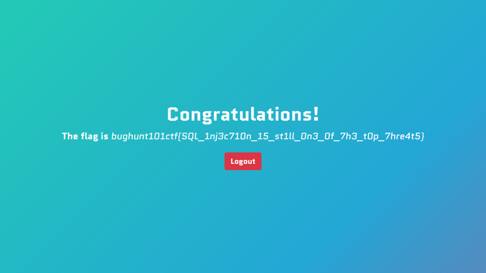

こんにちは、8ayacです🐝
今回は、"ISC BugHunt101 CTF 2020"で作問した3問のWriteupを書きました。
全部Webです。

## ISC BugHunt101 CTF 2020とは

ISC BugHunt101 CTF 2020は、筆者が、筆者の通う学校の生徒向けにプライベートで開催したCTFのことです。
最近、筆者の通う学校の生徒を対象に「バグハント入門」というテーマでオンライン講義を行う機会があり、その一環で開催したという経緯です。
講義自体は、合計400分で、CTFには最後の100分で、各々チームを作って挑戦してもらいました。
なお、参加者のレベル感的には、ほとんどが今までCTFに触れたことがないレベルだったと思います。

## 作った問題のリポジトリ

作った問題のソースコードや設定ファイルは、以下に置いてあります。
自分でもデプロイできるようになっているので、実際に解いてみたい人は、ご活用ください。

<https://github.com/8ayac/iscbughunt101ctf>

## [Web Easy (17/40teams solved)] SQLi101

### 問題文

```txt
Can you login?💉

http://sqli101.chall.8ayac.com/

Attachment: app.py
```

### 問題アプリの概要

配布された[app.py](https://github.com/8ayac/iscbughunt101ctf/blob/master/sqli101/sqli101/src/app.py)を読むと、アプリの機能は以下のようにまとめられます。

- `GET /`: トップページ
- `POST /login`: ログイン機能
  - POSTパラメータ`password`の値を使ってログイン処理を実行する
  - ログインに成功すれば、セッション`flag`の値にflagがセットされる。
- `GET /logout`
  - セッション`flag`の値を削除して、トップページに遷移する。
- `GET /admin`
  - セッション`flag`に値がセットされていれば、その値を表示する。
  - 値がセットされていなければ、トップページに遷移する。

実際に、問題のトップページにアクセスすると、以下のような、ログインページが表示されます。


### 最終目標の分析

機能を分析した結果、ログインに成功すれば、flagが手に入りそうだ、とわかりました。

[ソースコード](https://github.com/8ayac/iscbughunt101ctf/blob/master/sqli101/sqli101/src/app.py#L19-L26)を読んで見ると、ログイン処理にはis_admin関数が使われていることがわかります。

```python
@app.route('/login', methods=['POST'])
def post_login():
    password = request.form['password']
    if is_admin(password):
        session['flag'] = os.environ.get('FLAG')
        return redirect(url_for('get_admin'))
    else:
        return redirect(url_for('get_index'))
```

`is_admin`関数は、以下のような関数です。

```python
def is_admin(pw: str) -> bool:
    conn = MySQLdb.connect(
        host='db',
        user=os.environ.get('MYSQL_USER'),
        passwd=os.environ.get('MYSQL_PASSWORD'),
        db=os.environ.get('MYSQL_DATABASE')
    )
    cursor = conn.cursor()

    try:
        stmt = f'SELECT * FROM users WHERE username="admin" AND password="{pw}";'
        cursor.execute(stmt)
    except MySQLdb.Error as e:
        abort(500, description=repr(e))
    finally:
        conn.close()

    return cursor.rowcount > 0
```

`SELECT * FROM users WHERE username="admin" AND password="{pw}";`というSQL文を実行して、その結果、一行以上のレコードが取得できれば、ログインが成功するようです。
正しいパスワードを知っていれば、単にそのパスワード入力すれば、ログインできますが、今回は正しいパスワードは与えられていません。
そのため、何らかの別の方法で、このログイン処理を突破する必要がありそうです。

ということで、正規のパスワードを入力する以外の方法で、ログイン処理を成功させることを最終目標として設定して問題なさそうです。

### 解法

最終的に実行されるSQL文は、`POST /login`において、POSTパラメータ`password`の値を、(単に)f文字列で、ベースのSQL文に埋め込んで作られます。(参考:[app.py 53行目](https://github.com/8ayac/iscbughunt101ctf/blob/master/sqli101/sqli101/src/app.py#L53))
これが原因で、SQL Injectionによる攻撃が有効になっています。

今回は、例えば、`SELECT * FROM users WHERE username="admin" AND password="" OR "a"="a";`のようなSQL文になるように、POSTパラメータ`password`を与えればよさそうです。
このSQL文のWHERE句で指定した条件は、`OR "a"="a"`により、必ず真になります。
そのため、このSQL文が実行されて取得されるのは、`users`テーブルの全レコードになり、ログイン処理が成功します。

実際に、ログインページのフォームに`" OR "a"="a`と入力して、ログインボタンを押すと、以下のようにFlagが表示されます。



### Flag

`bughunt101ctf{SQL_1nj3c710n_15_st1ll_0n3_0f_7h3_t0p_7hre4t5}`

### 後記

入門者向けCTFでは定番のSQL Injection問題でした。
flagが出てくるページの背景がすごく綺麗だったと思います。

## [Web Medium (3/40teams solved)] BuggyBase2

### 問題文

```txt
Do you remember another BuggyBase?🤔

http://buggybase2.chall.8ayac.com/

Attachment: app.py
```

### 問題アプリの概要

トップページにアクセスしてみると、なんとなくどういうアプリかがわかります。


試しに、フォームに`hoge`と入力して、Encodeボタンをクリックしてみると、`hoge`をBase64エンコードした値が出力されます。


出力された値を、もう一度フォームに入れて、Decodeボタンをクリックすると、`hoge`と出力されます。


どうやら、任意の文字列をbase64エンコード/デコードするアプリのようです。

実際に、配布された[app.py](https://github.com/8ayac/iscbughunt101ctf/blob/master/buggybase2/buggybase2/src/app.py)を読むと、アプリの機能は以下のようにまとめられます。

- `GET /`: トップページ
  - GETパラメータ`s`の値をGETパラメータ`mode`の値に応じてBase64エンコードまたはデコードする。
  - GETパラメータ`mode`の値が指定されていない場合は、トップページにリダイレクトされる。
  - GETパラメータ`mode`の値に`encode`か`decode`以外が指定された場合は、エラーページを表示する。

### 最終目標の分析

ソースコードからは、どこにFlagがあるかがわからないため、ひとまず、何か利用できそうな脆弱性を探してみます。

ソースコードを読んでみると、`GET /`において、GETパラメータ`mode`の値に`encode`か`decode`以外が指定された場合の処理内で、`render_template_string`関数が安全でない使われ方をしていることがわかります。
具体的には、以下の部分を読むと、わかります。

```python
@app.errorhandler(500)
def internal_server_error(e):
    mascot = random.choice(list('🐌🐛🦟🐜🐝🐞🦂🦗🦋🕷'))  # just choose a mascot
    return render_template_string(f'{mascot} < {e.description}'), 500
```

また、`{e.description}`には、ユーザがGETパラメータ`mode`の値に指定した文字列が入ります。
これは、app.pyの[20-21行目](https://github.com/8ayac/iscbughunt101ctf/blob/master/buggybase2/buggybase2/src/app.py#L20-L21)から読み取れます。

```python
if mode not in ['encode', 'decode']:
    abort(500, description=f'invalid mode ({mode=}) specified')
```

以上のことから、この機能には、XSSやSSTIに対する脆弱性がありそうだ、とわかります。
今回は、XSSを利用しても、特に嬉しいこともなさそうなので、SSTIを用いたRCE(Remote Code Execution)を試すと良いでしょう。
もしかすると、サーバ内にflagが書かれたファイルが隠されているかもしれません。

あえて、最終目標を設定するのであれば、SSTIを用いてRCEを実行すること、とすれば、ひとまず良さそうです。

### 解法

例えば、`{{cofig.__class__.__init__.__globals__['os'].popen(★).read()}}`という文字列の`★`の部分をOSコマンドに置き換えることで、サーバ側でそのOSコマンドを実行させ、その結果を表示することができます。
実際に、`ls -la`コマンドを実行してみると、`flag.txt`というファイルがあることがわかります。


ちなみに、表示が見づらい場合は、ペイロードの頭に`<pre>`を、末尾に`<!--`を付けると、見やすくなります。


さて、`cat flag.txt`というコマンドを実行させて、flag.txtの内容を見てみると、flagが表示されました。


### Flag

`bughunt101ctf{Y0u_d1d_r3vi3wed_S3rv3r_51d3_73mpl4t3_1nj3ct10n!}`

### 後記

この問題は、講義の中で、一度詳細に扱った[buggybase](https://github.com/8ayac/buggybase)の改題です。
CTF的には、このような焼き直しが良くないことは承知していますが、今回は講義の一環の学習用CTFなため、セーフかな、と思っています。

元のbuggybaseと違う点は、ペイロードをインジェクションできるポイントです。
元のbuggybaseでは、トップページのフォームにBase64デコードに失敗するような文字列を入力して、Decodeボタンを押せば、エラーメッセージの画面が表示されるようになっていました。
一方、buggybase2では、エラーメッセージの画面を表示させるために、URLパラメータ`mode`を操作する必要があったため、その分少し難しかったかもしれません。しかしながら、やはり講義で一度扱っていることもあり、難易度はMediumとしました。

講義の復習ができていれば、十分に解ける問題だったのではないでしょうか。

## [Web Hard (0/40teams solved)] SSRF101

### 問題文

```txt
I want to understand SSRF perfectly, you know?

http://ssrf101.chall.8ayac.com/

Attachment: app.py
```

### 問題アプリの概要

問題文に記載された、URLにアクセスすると、以下のようなページが表示されます。


inputURLと書いてあるので、試しに`http://example.com`と入力して、Submitしてみます。
すると、以下のように`hostname is not included in the white list`と怒られます。
どうやら、入力されたURLのホスト名は、予め用意された許可リストで検証されるようです。


では、配布された[app.py](https://github.com/8ayac/iscbughunt101ctf/blob/master/ssrf101/ssrf101/src/app.py)を見てみましょう。

```python
from urllib.parse import urlparse
from urllib.request import urlopen

from flask import abort, Flask, render_template, render_template_string, request

app = Flask(__name__)


@app.route('/', methods=['GET'])
def get_index():
    return render_template('index.html')


@app.route('/', methods=['POST'])
def post_index():
    url = request.form['url']

    whitelist = ['shemhazai', 'ssrf101', 'nginx']
    if urlparse(url).hostname not in whitelist:
        abort(500, description='hostname is not included in the white list')

    return render_template('index.html', result=get_url_content(url))


@app.errorhandler(500)
def internal_server_error(e):
    tmpl = 'Error: {{err}}'
    return render_template_string(tmpl, err=e.description), 500


def get_url_content(url: str) -> str:
    try:
        res = urlopen(url)
        return res.read().decode()
    except Exception as e:
        abort(500, description=e)


if __name__ == '__main__':
    app.run()
```

実際に読んでみると、このアプリの機能は以下のようにまとめられます。

- `GET /`: トップページ
  - URLを入力するフォームがある
- `POST /`: URLを開いて表示する機能
  - POSTパラメータ`url`で指定したURLをurlopenで開き、そのレスポンスを表示する。
  - 指定して、開けるURLのホスト名は`shemhazai`、`ssrf101`、`nginx`のいずれかにしなければならない。(参考: [app.py 18行目](https://github.com/8ayac/iscbughunt101ctf/blob/master/ssrf101/ssrf101/src/app.py#L18)の許可リスト)

### 解法(アプローチ)

#### Step1(`http://{許可リストで許可されているホスト}/`を指定してみる)

ひとまず、トップページのフォームに、`http://{許可リストで許可されているホスト}/`のようなURLをURLを指定してSubmitしてみます。
httpスキームやhttpsスキームは、URIスキームとしては、最も一般的なものなので、この流れは自然かと思います。

実際に各URLを試してみると、`http://shemhazai/`を指定した際に、以下のようなヒントが得られます。


ヒントを読んでみると、どうやらflagはssrf101(ホスト名)の`/this_is_secret.txt`にあるようで、そのファイルを読み取れば良いみたいです。

#### Step2(`/this_is_secret.txt`の読み取り)

実際には、fileスキーム(`file://`)[^1]を利用すれば、サーバ内のファイルを読み取ることができます。
今回は、ssrf101内の`/this_is_secret.txt`を読み取りたいので、`file://ssrf101/this_is_secret.txt`というURLを開かせれば良さそうです。

実際に、`file://ssrf101/this_is_secret.txt`をフォームに入力して、Submitすると、以下のようにflagが表示されました。


### Flag

`bughunt101ctf{Y0u_c4n_us3_SSRF_t0_p3rf0rm_4_L0cal_F1l3_1nclu510n}`

### 後記

SSRFの基本原理と、fileスキームを使ったLFIの手法を知っていれば解ける問題だと思います。

前者は、講義の中でも少し触れていたので、理解している人も少なくないのではないか、と考えています。
後者に関しては、講義の中では触れていませんでしたが、単純なGoogle検索で発見できるレベルの情報に設定しました。
例えば、(作問時に)「SSRF read file」とGoogle検索して、[一番上に出てきた記事](https://medium.com/@neerajedwards/reading-internal-files-using-ssrf-vulnerability-703c5706eefb)には、以下のような記述がありました。

> i was able to read internal files from file:/// scheme.

講義の中で重要と伝えていた、GIYF(Google Is Your Friend)のマインドを実践できれば、十分解ける難易度の問題である、と想定していたのですが、見誤ったかもしれません。
問題の難易度を推測するのは、やはり難しいですね。

## 作問にあたり注意したこと

作問にあたり、入門者が解きやすいように、いくつか工夫した点があります。

まず、問題は全て、アプリ本体のソースコード(app.py)だけを配布して、解けるように作りました。
これは、今回は配布ファイル数が多くなるほど、入門者は混乱すると考えたからです。
もしかしたら、Dockerfileやdocker-compose.ymlを配布した方が、解きやすかったかもしれない、という気持ちは今でも拭えません。

また、アプリ本体のソースコードは必ず100行以内で実装する、という制限も設けていました。
これも、入門者フリーにするための工夫です。(行数が少なければ簡単か、と言われれば、必ずしもそうではないかもしれませんが。)

あとは、全ての問題は、ローカルプロキシツールを用いず、ブラウザがあれば解けるような問題にしました。
これは、講義内で、ローカルプロキシツールの使い方に関するレクチャーをしていなかったためです。
講義はオンラインで実施していたため、トラブルシューティングのサポートが困難である、と予想して、講義全体を通して、ローカルプロキシツールは利用しませんでした。

以上のような工夫が有効に働いたことを、祈っています。

## 総評

難易度の見積もりが難しいですね。
実際のSolve数を見ても、参加者のレベルに対して、難しい問題が多くなってしまった感じがします。
これについては、脆弱性を発見できても、exploitの段階まで持っていけなかった方が、そこそこいそうだな、と考えています。
講義の内容的に、脆弱性を発見するための"考え方"についてはよく触れていた一方で、実際にその脆弱性がどのように利用(悪用)されるのか、については、詳細に触れていなかったことが影響していそうです。

ただ、難易度が高くても、楽しんでくれた方は想像以上にいて、嬉しかったですね。
「CTFをやったのは初めてだったが、解けたときが嬉しかった。」という声がいくつかあり、「わかり」が発生しました。


実は、準備期間が一週間未満な中で、作問以外にも、問題サーバやスコアサーバの準備なども一人でやっていました。
すべて初めての経験だったのですが、特に問題もなく運営(?)できて良かったです。
プライベートな開催だったことと、参加してくれた皆さんの治安が、想定よりも遥かに良かったことに助けられました。
そのへんの話も(余力があれば)書いてみようかな、とは思っています。

## 感想

自分が作った問題が解かれるのが楽しかった😀

<blockquote class="twitter-tweet" data-conversation="none"><p lang="ja" dir="ltr">今日で8コマ分全部終わった。ラストはCTF形式で演習をやってもらいました！自分が用意した環境で、自分が作った問題解かれるのは楽しいですね。(ところで、講義全体を通して、教える側としても色々と勉強させてもらったなあ🤔) <a href="https://t.co/nn52CNXER8">pic.twitter.com/nn52CNXER8</a></p>&mdash; 8ayac(Yoshinori Hayashi) (@8ayac) <a href="https://twitter.com/8ayac/status/1280761620487000064?ref_src=twsrc%5Etfw">July 8, 2020</a></blockquote>

## 注釈

[^1]: 参考: [RFC 8089 - The "file" URI Scheme](https://tools.ietf.org/html/rfc8089)
