こんにちは、8ayacです🐝

本記事では、2020/10/24(土)に開催したISCCTF 2020について、反省を交えて色々書きました。
筆者は、問題サーバのデプロイ以外をほぼ全てを担当していたため、書くことが多く、少し長めの記事になりましたが、興味のあるところだけでも読んでもらえると嬉しいです。

ちなみに、ISCCTF 2020自体は、(SurveyやTwitterのリアクションを見ている限りでは、)想像以上に好評でした。
競技開始前も競技中も、色々な心配を抱えながら運営をしていたので、安堵しています。

## 「ISCCTF 2020」の概要

ISCCTF 2020の概要は以下の通りです。

- 開催期間
  - 2020/10/24(土) 10:00 ~ 23:00 (JST)
- 参加者数
  - 登録ユーザ数: 135
  - 獲得スコア1点以上のユーザ数: 84
- 想定参加者レベル: CTF入門者～初心者
- 運営: [IPFactory](https://twitter.com/_ipfactory_)
- 問題アーカイブと公式Writeup: <https://github.com/IPFactory/ISCCTF2020>

### 開催の経緯

ISCCTF 2020は、筆者の通う[情報科学専門学校](http://isc.iwasaki.ac.jp)のオンライン学園祭のイベントの一つとして開催されました。
筆者は、そのオンライン学園祭の実行委員的な役割[^1]をしていたため、学園祭の催しものを提案しやすい立場にあり、そこで「CTFの開催はいかがか」と提案したことが、開催のきっかけになりました。

個人的な気持ちではありますが、以前から「IPFactory CTFを開催してみたい」という気持ちや「CTFの運営をやってみたい」という気持ちを持っていました。
今回、「学園祭のイベントとしてCTFを開催するのだから、学校からお金を出すよ。」と言っていただいたこともあり、この機会での開催を決断した次第です。
なお、CTF開催の心理的ハードルは割と高めでしたが、あくまでも「学内の入門者向け」と自分に言い聞かせることで、無理やりに心理的ハードルを下げました。
結果的には、今後のIPFactory CTF開催に繋げられる[^2]ノウハウを得られた、という点で、開催して良かったな、と感じています。

### スケジュール

ISCCTF 2020は、学園祭のイベントの一つだったため、2020/10/24日(土)に開催しなければならない、という要件がありました。
この要件により、本番までの準備期間は6週間と決まりました。
学業やインターンシップで忙しいメンバーも多く、中には他のCTFの作問も並行していたメンバーもおり、かなり余裕のないスケジュールだったと思います。
作問やレビュー、インフラの準備、開催のアナウンス、その他諸々の準備を万全に行おうとすれば、作業者の人数にもよるでしょうが、最低でも3~4ヶ月程度は必要なのではないでしょうか。
準備期間に余裕がない状態で、CTFを開催すると、所々に不安を抱えたまま開催することになり、胃に悪いです。

### CTFの対象者想定レベル

学園祭のイベントと一つとしてやる、ということで、ターゲットは学内の入門者～初心者としました。
[ABC](https://ja.wikipedia.org/wiki/AtCoder#AtCoder_Beginner_Contest_(ABC))でいうB問題を解けるレベルのコーディングスキルを有しており、Linuxコマンドを扱える程度の技術があれば、最低でも2~3問は解けるレベルを目指しました。
他のCTFと比較するとすれば、SECCON beginners CTF 2020よりも少し簡単なレベルを目指していました。

ターゲットを学内の入門者～初心者と設定した一方で、CTFには外部からも参加できるようにしよう、という方針が当初からありました。
この方針を定めていた理由は、おおまかに下記の2点です。

- プライベート開催にした場合、参加者が極めて少数になることが予想され、やりがいを感じられなかったため。
- 外部の経験者の方からのフィードバックを得たかったため。

参加者数があまりに少ないと、単純に責任感が生まれづらいですし、イベントとしても盛り上がりに欠けるものになってしまいます。
また、ある程度の参加があった方が有益なデータ(発生するトラブル・サーバへの負荷などについて)を、より多く採れると考えました。
これは、今後もCTFを開催する可能性があることを考えると、重要なことでした。
経験者の方からのフィードバックが得たかったのも、今後のことを見据えてのことです。

### 運営メンバーと役割分担

ISCCTF 2020は、私の所属するサークル[IPFactory](https://twitter.com/_ipfactory_)のうち、下記のメンバーでご覧の分担をして、運営しました。
彼らの力がなければ、ISCCTF 2020は開催できませんでした。
皆さん、ご協力いただきありがとうございました。

- [@8ayac](https://twitter.com/8ayac): 作問(Web)・レビュー(Pwn/Rev/Misc)・問題サーバ以外のインフラ・文章作成(ルール、ツイート、etc)・プロジェクト管理・学校との調整等
- [@a_zara_n](https://twitter.com/a_zara_n): レビュー(Web)・インフラ(問題サーバ)
- [@Drumato](https://twitter.com/Drumato): レビュー(Rev)
- [@iria_piyo](https://twitter.com/iria_piyo): 作問(Forensics)
- [@scgajge12](https://twitter.com/scgajge12): レビュー(Web)
- [@n01e0](https://twitter.com/n01e0): 作問(Pwn全部/Rev全部/Misc)
- [@odgrso](https://twitter.com/odgrso): レビュー(Web)
- [@ry0kvn](https://twitter.com/ry0kvn): 作問・レビュー(Forensics)
- [@wa1m3im](https://twitter.com/Wa1m3): 作問(Web)
- [@y0d3n](https://twitter.com/y0d3n): 作問(Web)
- [@yky4n4g1](https://twitter.com/yky4n4g1): 作問(Misc)

こうしてまとめてみると、筆者の担当が多く見えますが、これは、ほとんどのメンバーはインターンや他のことで忙しい中、筆者はただの学生だったためです。
むしろ、ただの学生をしていたことを考えると、ダラけていた方だと思います。
(実際、序盤のツケのおかげで、最後の一週間程度は、時代にそぐわないブラックな働き方をすることになりました。)

### 開催にあたり参考にしたCTF

ISCCTF 2020を開催するにあたり、いくつか参考にしたCTFがあります。
具体的には、下記のCTFを特に参考にしました。

- TSGCTF
- InterKosenCTF

これらのCTFを参考にした理由は、最近開催されたCTFの中で作問・インフラともに評判がよく、開催記やアーカイブが残されていたからです。
参加記やアーカイブは、2020年のものに限らず、さらに過去のものも、遡って参考にさせていただきました。
今回のISCCTF 2020に参加していただいた猛者の中には、ISCCTF 2020の随所に、これらのCTFから倣った部分があることに気づいた方もいるかもしれません。

また、作問の面で、入門者向けCTFにふさわしい問題のレベルを知るために、SECCON beginners CTF 2020も参考にしました。
前述の通り、ISCCTFの問題は、このSECCON beginners CTF 2020の問題よりも少し簡単なレベルを目指して、作られていました。

## 作問について

作問では、問題の質に特にこだわりました。
対象レベルは入門者～初心者向けでしたが、CTFプレイヤーの端くれとして、「"クソ問"は出さない」という強い気持ちを持っていました。
これは、CTFを開催する上では、譲れないポイントでした。

### 作問・レビュー時に読んでおくとよい資料

作問・レビュー担当には、最低限でも下記の資料を読むように強く促しました。
個人的には、CTFの作問をする人は、必ず目を通すべき資料だと感じます。
筆者自身、今回の作問・レビュー作業では、何度も下記の資料を読み返していました。

- [CTF Design Guidelines](https://docs.google.com/document/d/1QBhColOjT8vVeyQxM1qNE-pczqeNSJiWOEiZQF2SSh8/preview)
- [docs/suggestions-for-running-a-ctf.markdown at master · pwning/docs](https://github.com/pwning/docs/blob/master/suggestions-for-running-a-ctf.markdown)
- [CTFの問題を作るときに気をつけること](http://icchy.hatenablog.jp/entry/2018/09/17/083648)

### レビューのポイント

今回ISCCTF 2020で出題した問題は、全て一回以上のレビューが行われています。
粗悪な問題を出題しないためにもレビューが重要であることは、言うまでもないと思います。

レビューでは、下記のポイントを**最低限見るべきチェックポイント**としていました。
これらのチェック項目を作る際には、『[CTFの問題を作るときに気をつけること](http://icchy.hatenablog.jp/entry/2018/09/17/083648)』とTSGCTFの方が書いていた[開催記](https://hakatashi.hatenadiary.com/entry/2019/08/09/200000#:~:text=CTF%E5%95%8F%E9%A1%8C%E3%81%AE%E3%83%AC%E3%83%93%E3%83%A5%E3%83%BC%E3%83%81%E3%82%A7%E3%83%83%E3%82%AF%E3%83%9D%E3%82%A4%E3%83%B3%E3%83%88)を参考にしました。

- エスパー問でないか
- 想定外の解法が存在しないか
- 問題を破壊することができないか
- サーバーに過度な負荷がかからないか
- 非本質的な妨害要素がないか
- 「面白くない」要素が可能な限り排除されているか。

チェック項目については、筆者の方である程度厳選しました。
あまりに項目を多くしすぎても、各項目でのレビューが疎かになってしまう気がしたからです。
理想的には、上記の資料で紹介されているすべてのポイントを、レビューで見る必須項目とするべきでしょう。

### PPC問題の扱い

ISCCTF 2020ではPPC問題を0点のおまけ問題として出題しました。
これは、CTFがコンピュータセキュリティ技術の競技であることを考えたとき、「PPCは出題すべきではないのでは？」という懸念を拭いきれなかったためです。
プログラミング技術もセキュリティ技術の一つである、という事実もありますが、この辺は難しい問題のように思えます。

作問開始当初は、「PPCもちょくちょく見るし、出しても問題ないだろう。」という安易な考えで、筆者も「PPCもいいっすよ！Miscで出そう！🤪」と無責任なことを言っていました。
しかしながら、本番が近づくに連れ「CTFってなんだっけ。PPCを出す場として適当なのか?」と気になっていき、改めてCTFの定義を調べたり、TwitterでPPCに対するリアクションを検索していくうちに、「(少なくとも今回出題した[maze](https://https://github.com/IPFactory/ISCCTF2020/tree/main/misc/maze)は)やめておいた方が良さそう」という気持ちが強くなっていきました。

最終的に、PPCの作問者である[@yky4n4g1](https://twitter.com/yky4n4g1)に謝って、Miscのmazeは0点問題として出題することに決まりました。
ちなみに、その際、Twitterで見つけた下記の@theoremoonさんのツイートを、彼に紹介したところ「競プロでPwn出されたくないのでOKです」と快諾を得られました。

<blockquote class="twitter-tweet"><p lang="ja" dir="ltr">CTFでPPCだすな競プロでpwn出すぞ</p>&mdash; 非想定解太郎 (@theoremoon) <a href="https://twitter.com/theoremoon/status/1282211066848542720?ref_src=twsrc%5Etfw">July 12, 2020</a></blockquote>

### 問題の評判

競技終盤で公開したSurveyでは、下図のような評価をいただきました。
この結果を見て、「それなりに好評価なのでは?」と嬉しくなりました。
一方で、次回以降の開催における問題の質に対するハードルは上がったように感じており、身が引き締まる思いです。

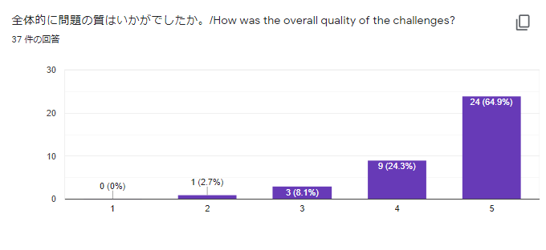

また、「問題に関する意見があれば教えてください。」という質問に対し、下記の回答をいただくことができました。
これは、「自明問ばかりの虚無CTF」という経験者の方の評価が何件来るかドキドキしていた筆者にとって、飛び上がるほど嬉しいコメントでした。

> いわゆるエスパー問やクソ問はなく、どのカテゴリの問題もバラエティに富んでいて面白い問題ばかりで楽しむことができました。「CTF入門者向け」と銘打たれていましたが、初心者でも経験者でも楽しむことのできるCTFであったように思います。

## インフラ

ISCCTF 2020のインフラにはGCPを使いました。
これは、他のクラウドサービスと比べたとき、筆者が最も触ったことのあるのがGCPだったから、というのが大きいです。
また、[TSGCTFさんの開催記](https://hakatashi.hatenadiary.com/entry/2019/08/09/200000#:~:text=%E4%BB%8A%E5%9B%9E%E3%81%AE%20TSG%20CTF%20%E3%81%AE%E3%82%A4%E3%83%B3%E3%83%95%E3%83%A9%E3%81%AB%E3%81%AFGCP%E3%82%92%E7%94%A8%E3%81%84%E3%81%BE%E3%81%97%E3%81%9F%E3%80%82)からも色々と参考にできるだろう、という考えもありました。

ここでは、筆者が担当していた、スコアサーバの構築・運用・監視、そして、問題の死活監視あたりの話を書きます。
このあたりは、正直なところ、全く経験がなかったため、常に心配を抱えながらやっていました。
結果的には、大きな問題もなく、安定した競技環境を提供することができました。
しかしながら、これについては、単に運が良かっただけだと捉えています。

### スコアサーバ

スコアサーバは、GCE(Google Cloud Engine)でUbuntuのVMインスタンスを作成し、その上で、[CTFd](https://github.com/CTFd/CTFd)を動かしていました。
CTFdの起動には、公式の`docker-compose.yml`を、ほぼそのまま使いました。
Nginxだけは、dockerコンテナとして起動せず、Ubuntuに予めインストールしたものを使っていました。
これは、CTFdを稼働させる前に、スコアサーバのHTTPS化の作業を行っていたからです。

#### 複数台構成のロードバランシング(はできなかった)

実は、スコアサーバは終始1台で動いていました。
これについては、特に大層な理由はなく、単に筆者の勉強不足が原因です。

スコアサーバを構築した当初、「とりあえず、一台建てておけば、後からでもロードバランシングは構成できるんだよね😇」という思い込みを持っていました。
その思い込みの下、GCEでUbuntuイメージを利用したVMインスタンスを作成し、その上でCTFdを動かし終えたところで満足し、「よし、とりあえず、スコアサーバも準備できたし、作問作業が落ち着いてからロードバランシングやるか！」と、考えていたのですが、結果的には失敗した、という次第です。

本番がかなり近づいてきて、作問作業も徐々に落ち着いて来た頃に、スコアサーバの負荷分散の作業を行い、色々と調べたところ、ロードバランシングを構成するためには、[インスタンステンプレート](https://cloud.google.com/compute/docs/instance-templates?hl=ja)を作成する必要があることに気づき、手遅れになりました。
また、これも当然のことですが、CTFdが利用するDBも集約する必要がありました。

これらのことに気づいたのが、本番まで残り2日時点のことだったため、構成を変更した際に、すでに登録されているデータを誤って消してしまうのも怖く、複数台構成でのロードバランシングは諦めた次第です。

#### それでも落とさないために

複数台構成で負荷分散を行うやり方は失敗しましたが、それでもスコアサーバは落としたくありませんでした。
そのため、スコアサーバでは、下記のような対策をして、スコアサーバが落ちないようにしていました。

- インスタンスのマシンタイプを`e2-standard-16`に変更
- Nginx/gunicornが起動するworkerプロセスの数を8に変更

「過剰かもしれない」という気持ちもありましたが、パブリックなCTFの運営は初めてで、Webサービス運用の経験も乏しいため、「うまくやろう」という気持ちは早々に捨て、とにかくスコアサーバを落とさないことを重視しました。
今回は、**うまく**やることはできませんでしたが、今回取れたデータからよく学び、次回の開催があれば、少しでも**うまく**できれば良いな、と考えています。

#### 負荷試験

スコアサーバを落とさないように施す対策が上記のように落ち着くまでには、何度か負荷試験を行いました。
試験の実施には、[Apache JMeter](https://jmeter.apache.org/)を利用しました。
このツールは、ドキュメントも豊富だったため、簡単な利用で困ることは、ほとんどありませんでした。
ちなみに、負荷テストを行う経験も初めてだったため、色々と調べながら見様見真似でやっていました。

下図は、スコアサーバに対する最終的な負荷試験の結果です。
単純なトップページへのGETリクエストであれば、400rps程度の処理能力があることを示しています。

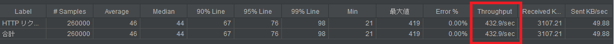

### 監視について

#### サーバへのアクセス・負荷の監視

サーバへのアクセスや負荷の監視は全て、GCPのMonitoringの機能を用いて行いました。
具体的には、ダッシュボードに下記のようにグラフを追加して、このダッシュボードを監視していました。

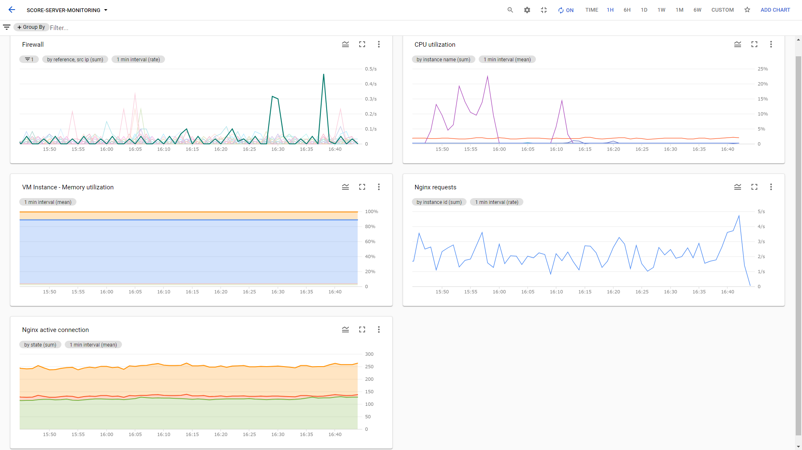

DoSまがいの異常なアクセスの検知方法については、[TSGCTFさんの開催記](https://hakatashi.hatenadiary.com/entry/2019/08/09/200000#:~:text=%E3%82%B0%E3%83%A9%E3%83%95%E3%81%AE1%E6%9C%AC%E3%81%AE%E7%B7%9A%E3%81%8C,%E4%BB%A5%E4%B8%8B%E3%81%AE%E3%82%88%E3%81%86%E3%81%AB%E8%B7%B3%E3%81%AD%E4%B8%8A%E3%81%8C%E3%82%8A%E3%81%BE%E3%81%99%E3%80%82)で勉強して、ISCCTF 2020も同様の方法で、DoSまがいの異常なアクセスを検知できるようにしていました。
実際の運用中、下図のように異常アクセスを検知できたのは、面白かったです。

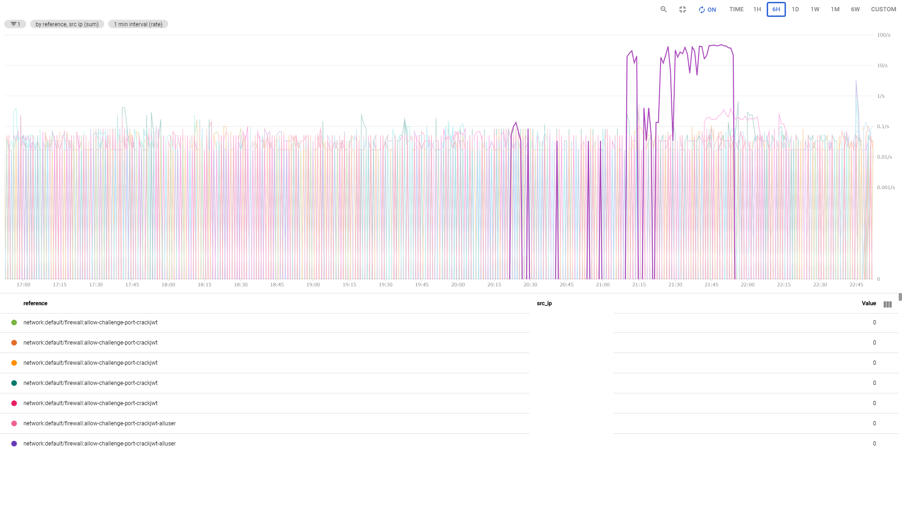

画像を見るとバレてしまうのですが、この異常アクセスは、ほぼ一時間続いていました。
これは、BANの体制が整っていなかったわけではなく、単に監視を担当していた筆者が他のことをしており、見逃していました。
サーバリソース的にもかなり余裕があったので、レスポンスが悪くなることはなかったかと思いますが、猛省しています。
人間、しばらく穏やかなグラフを眺めていると、どうしても気が緩んでしまうため、監視担当は一定時間で交代すべきだな、と思いました。

#### 問題の死活監視

問題の死活監視も、下記のリポジトリにあるスクリプト(SolvabilityInspetor)で自動化していました。
質については、本番の3日前に突貫で作ったものであり、正直まだまだ改善の余地があります。

<https://github.com/IPFactory/ISCCTF2020_SolvabilityInspector>

SolvabilityInspectorのおおまかな構造は、下記の図の通りです。

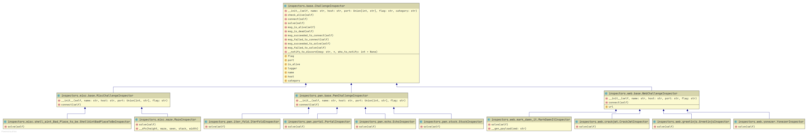

ログ出力や、後述するDiscordへのメッセージ送信機能は、ベースのInspector(`inspectors.base.ChallengeInspector`)で共通化しています。
この恩恵の一つして、ある問題を定期実行される死活監視の対象に組み込みたい場合にも、単にその問題のsolverを`<問題名>Inspector`クラスの`solve(self)`メソッドとして定義すれば、容易に組み込めるようになっています。

さて、このSolvabilityCheckには、Discordへの通知機能も付いています。
`.env`ファイル内で、DiscordのWebhookURLを適切に記述しておくと、適当なチャンネルで死活監視のログが流れるようになっています。
この機能は、本番前日に[InterKosenCTFさんの開催記](https://furutsuki.hatenablog.com/entry/2020/09/06/230446)を読み返していた際に思い出し、急いで追加実装しました。
下図は、実際の競技中にDiscordで公開されていたログの様子です。

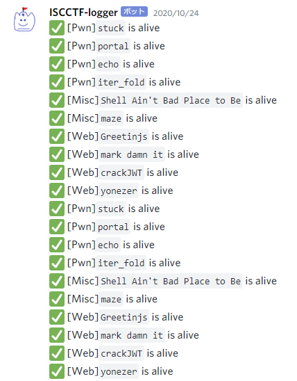

また、`.env`において、DiscordのロールIDを指定すれば、問題が正常に解けない状態だったときに、そのロールに対しメンションが飛びます。
さらに、問題が正常に解けない場合の通知には、そもそも環境への接続できないのか、それとも、何らかの原因で問題が正常に解けない状態なのか、を切り分けやすいような情報が付与されます。
なお、競技中には、問題が解けない状態になることが一度もなく、残念ながら、この機能が活躍することはありませんでした。
下図は、試験的に動かしていた際の様子です。

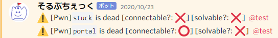

ちなみに、一問だけ[嘘Solver](https://github.com/IPFactory/ISCCTF2020_SolvabilityInspector/blob/main/inspectors/misc/shell_aint_Bad_Place_to_be.py)で死活確認を行っていた問題があります。
[この問題](https://github.com/IPFactory/ISCCTF2020/tree/main/misc/shell_aint_bad_place_to_be)は、解く過程で問題サーバにファイルを作成する必要があり、作成したファイルを削除できない制約がありました。
死活監視のSolverがもしファイルを作れば、それがヒントになる可能性があったため、死活監視は疎通確認のみに留めておいた、という事情です。
このように、問題の死活監視を行う場合は、死活監視Solverによって参加者にヒントを与えてしまわないか、という点には注意した方が良さそうです。

## 作業効率化について

CTF運営に関する作業(特に作問作業)は、運営チーム全体で進めていました。
ここでは、複数人での作業を効率化するために行っていた工夫について、反省を交えて紹介します。

### GitHub

作問・レビュー作業は、GitHubを用いて進めていました。
下図は、実際にGitHub上で行っていたレビューの様子を抜粋したものです。

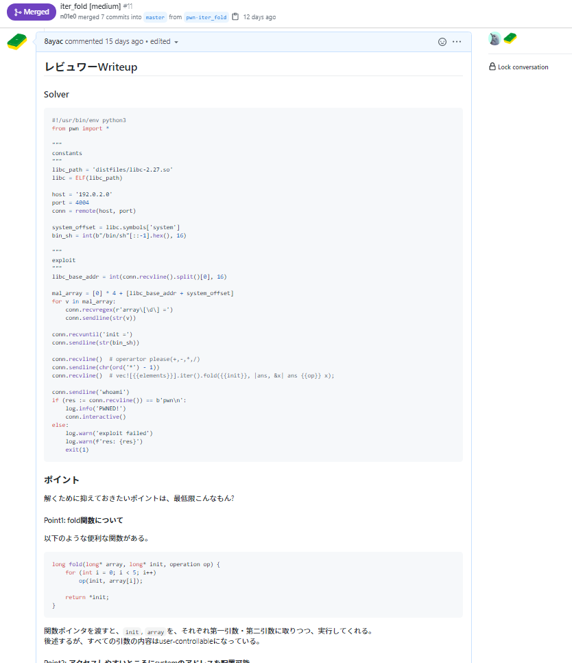
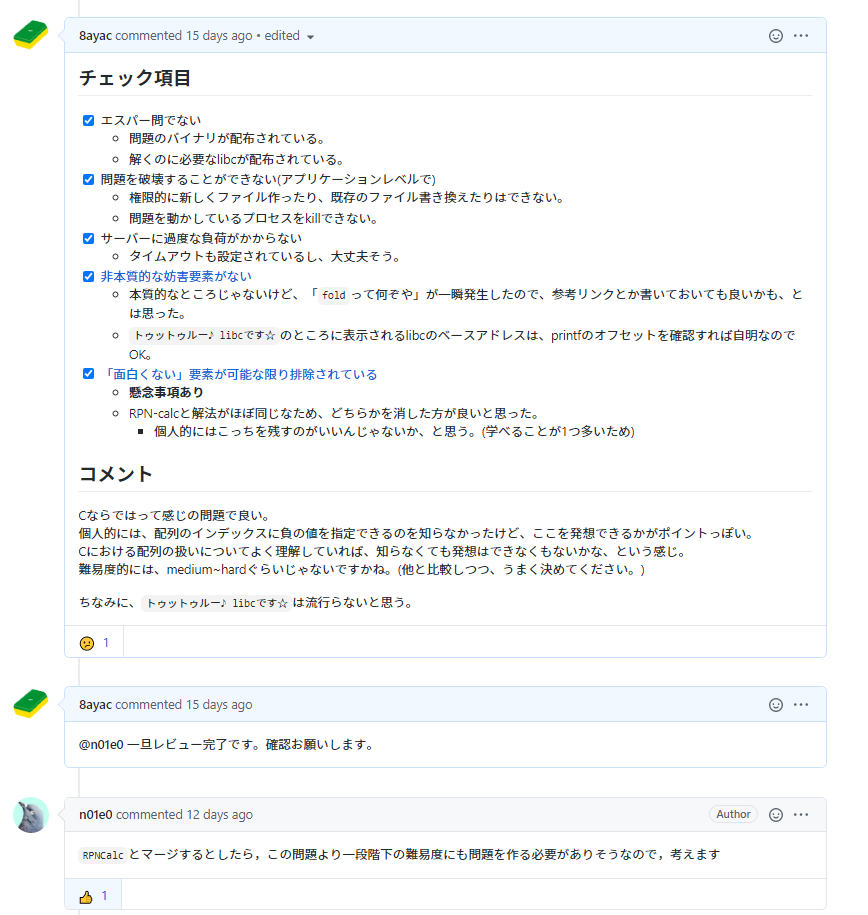

GitHubを使うことで、下記のように、通常のチーム開発のような感じで作問作業を進められました。

1. `<カテゴリ名>-<問題名>`という名前でブランチを切る
2. 問題ができたらプルリクを作る
3. プルリクのレビュワーに問題のレビュワーを指定する
4. レビュワーが問題のレビューをする
   1. レビューで修正点がない場合: 作問者側でmasterブランチにマージして終了
   2. レビューに修正点があった場合: 修正をpushして再レビュー申請
5. 4に戻る

上記の手順に従うことで、(ほとんどの段階で)masterブランチにあるものが本番で出題するべき問題である状態を保つことができ、わかりやすかったです。

また、GitHubでは、リポジトリの権限をユーザ単位で管理できるため、問題の内容の漏洩対策としても良かったと思います。
HackMDの共有機能やGistのSecret Gistなどを用いる話もありましたが、それらの機能を用いて問題・レビュー内容を共有した場合、URLが漏洩した際には問題の内容が漏れてしまいます。
適切に権限設定されたGitHubのリポジトリであれば、このようなURL漏洩によるリスクはかなり軽減されます。
運営メンバーの中には、オンライン授業やオンライン勉強会で自分の作業画面を映す機会が多いメンバーもいたため、この辺りのリスクは無視できませんでした。

また、IPFactoryとしては、大会終了後に作問・レビューのログが見れるようになる[^3]ので、知見を残しやすい、という点でもGitHubの利用は正解だったと思います。

### Googleスプレッドシート

各問題の進捗状況や問題で使うポートを管理をするのに、Google スプレッドシートを活用しました。
これにより、下図のように、一目で各問題の状況が把握できるようになっていました。
(ポートの管理については、今回は問題ごとにサーバを分けたので、結果的には不要でした。)

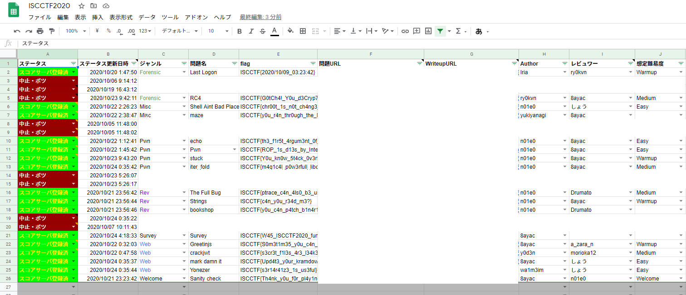

画像を見ていただければ、なんとなくどんな感じで使うのかはわかるかと思いますので、詳細な説明は省き、特に工夫している点を紹介します。

まず、B列「ステータス時間更新日時」は、A列「ステータス」の内容が変更された際に自動更新されるようになっています。
これには、[GAS(Google Apps Script)](https://workspace.google.co.jp/intl/ja/products/apps-script/)を利用しました。

次に、各問題のflagは、「データの入力規則」の機能により、ルールで定めたflagの形式に対し、適切なflagを設定しているかが検証されるようになっています。
「データの入力規則」の機能を用いると、誤った形式のflagを入力しないように、下図のように警告が出したり、誤った形式の文字列の入力を拒否するような設定ができます。
これは、人間のミスを防ぐ上で、良い仕組みだったと思います。

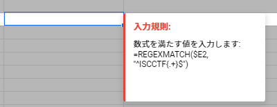

これは反省点ですが、スプレッドシートへの情報の登録は、何らかの方法で自動化しておくべきだったと思います。
というのも、ステータス更新を忘れている人も多く、スレッドシートと実際の進捗状況が同期していないことがよくあったためです。
例えば、GitHub Actionsを使って、プルリクに何かアクションを起こした人に対し、全般的なやり取りに使っていたDiscord側で、「スプレッドシートのステータス変更もお願いします」というメッセージを送るだけでも、かなり違ったかもしれません。

### 楽しいCTFになるように

#### Solveログの提供

これは完全に[InterKosenCTF 2020](https://furutsuki.hatenablog.com/entry/2020/09/06/230446#:~:text=Discord%E3%81%AEctf-log%E3%81%A8%E3%81%84%E3%81%86%E3%83%81%E3%83%A3%E3%83%B3%E3%83%8D%E3%83%AB%E3%81%A7%E3%81%AF,%E9%87%91%E3%83%BB%E9%8A%80%E3%83%BB%E9%8A%85%E3%83%A1%E3%83%80%E3%83%AB%E3%81%AE%E7%B5%B5%E6%96%87%E5%AD%97%E3%82%92%E3%81%A4%E3%81%91%E3%81%9F%E3%82%8A%E3%81%97%E3%81%A6%E3%81%84%E3%81%BE%E3%81%97%E3%81%9F%E3%80%82)を真似させてもらったのですが、下図のように、Discord上で、誰がどの問題を解いたか、を流していました。

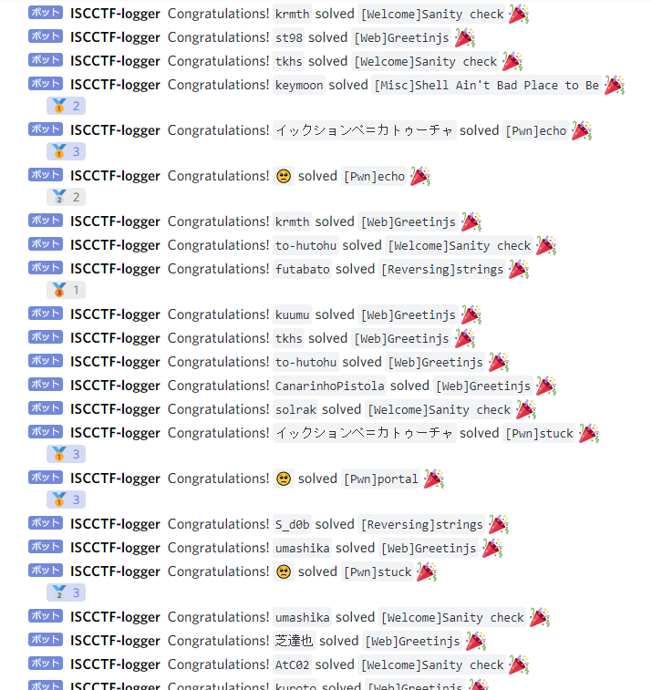

なお、この機能は、CTFdのソースコードに下記のように手を加え、実現しました。

```diff
diff --git a/CTFd/api/v1/challenges.py b/CTFd/api/v1/challenges.py
index f24e38d..adfa315 100644
--- a/CTFd/api/v1/challenges.py
+++ b/CTFd/api/v1/challenges.py
@@ -1,6 +1,8 @@
+import os
 import datetime
 from typing import List

+import requests
 from flask import abort, render_template, request, url_for
 from flask_restx import Namespace, Resource
 from sqlalchemy.sql import and_
@@ -579,6 +581,10 @@ class ChallengeAttempt(Resource):
                     )
                     clear_standings()

+                discord_webhook_url = os.getenv('DISCORD_WEBHOOK_URL')
+                discord_log_msg = f'Conguratulations! `{user.name}` solved `[{challenge.category}]{challenge.name}` :tada:'
+                requests.post(discord_webhook_url, data={'content': discord_log_msg})
+
                 log(
                     "submissions",
                     "[{date}] {name} submitted {submission} on {challenge_id} with kpm {kpm} [CORRECT]",
```

#### Twitterで参加者のツイートをいいね

Twitterでは、ISCCTF 2020に関連していそうなツイートを探し、[IPFactoryのアカウント](https://twitter.com/_ipfactory_)のアカウントを使って、片っ端からいいねしていきました。
これは、CTFに限りませんが、イベントにおいて、公式からのリアクションは「イベントに参加している感」を生む重要な要素だと思います。
「イベントに参加している感」は、イベント参加における充実感に関わるような気がしており、ISCCTF 2020では、参加してくれた人に少しでも楽しんでもらえれば良いな、という意図で、このようなことをやっていました。
運営としても、参加者のリアルタイムな反応が窺えて、楽しかったです。

やり方は、Tweetdeckで特定のクエリの検索結果カラムを一つ作り、そこに現れるツイートをいいねする、という単純な方法を採っていました。
しかし、そのカラムに現れたユーザをリストにまとめておけば、クエリにかからないようなツイートも拾えるので、こちらのやり方のほうが良さそうです。
このことには競技終了間際に気づいたため、次回以降の開催があれば、この方法を採りたいと考えています。

## その他反省点

### CTFdの通知機能を途中まで忘れていた

CTFdにあるNotificationsの機能を使うことで、スコアサーバ上で、CTF参加者全体に連絡事項を通知できることを忘れていました。
このことに気づくまで、アナウンスをDiscord上でのみ実施しており、大きな反省点である、と捉えています。
本来であれば、参加者が必ず参加しているスコアサーバ上で通知を行った上で、Discord上でのアナウンスを行うべきでした。

また、複数のプラットフォームでアナウンスを行いたい場合は、自動化しておく方が良さそうです。
一つのインターフェースからアナウンスを投稿することで、各プラットフォームに自動でアナウンスが流れるような仕組みがあれば、どこかのプラットフォームでアナウンスをうっかり忘れるということもないでしょうし、全てのプラットフォームで、限りなく同時に近いタイミングのアナウンスが実施できます。
次回以降の開催があれば、この辺も実装しようと考えています。

## 総括的な何か

以前、学内向けの講義をやった際のミニCTF[^4]を除けば、今回が初めてのCTF運営でしたが、とても楽しかったです。
色々とお粗末なところもあったことを自覚していますが、ひとまずは、大きな問題もなく初めてのCTF運営をやりきったことに達成感を感じています。

記事内で何度か出てきたIPFactory CTFの話ですが、現状では完全に筆者の中の妄想でしかありません。
しかし、後輩諸氏が数年以内に実際に開催してくれるであろうと予想しつつ、そうなることを期待しています。
筆者は今年で卒業してしまうため、運営として関われないのが残念ですが、今回のISCCTF 2020開催で得た知見が、IPFactory CTF開催時の糧となれば良いなと考えています。

余談ですが、個人的には、もっと作問にガッツリ取り組みたかったな、と思いました。
今回は、他の担当の比重が大きすぎて、あまり力を入れられなかったのですが、やはり自分が作った問題[^5]を解かれるのは楽しいですしね。
中級者～上級者向けの問題の実装となると、作問の難易度も大きく上がりそうな気はしますが、チャレンジングで良さそうです。

## 注釈

[^1]: 情報科学専門学校の特待生は、このようなイベントの際、運営や運営のサポートとして駆り出されます。
[^2]: 筆者は来年には卒業してしまうので、運営には関われないかもしれない可能性が高く、寂しい思いです。そもそも、開催されるのかすらわかりませんが、後輩諸氏が頑張ってくれるだろうと期待しています。
[^3]: 競技終了までは、IPFactoryメンバーであっても、ISCCTF 2020運営メンバーでない限りは、CTF開発用リポジトリの内容は見れないようになっていました。
[^4]: <https://caya8.hatenablog.com/entry/2020/07/16/083000#:~:text=ISC%20BugHunt101%20CTF%202020%E3%81%A8%E3%81%AF>
[^5]: 今回作った問題については[こちら](https://caya8.hatenablog.com/entry/2020/10/28/075659)に書きました。
