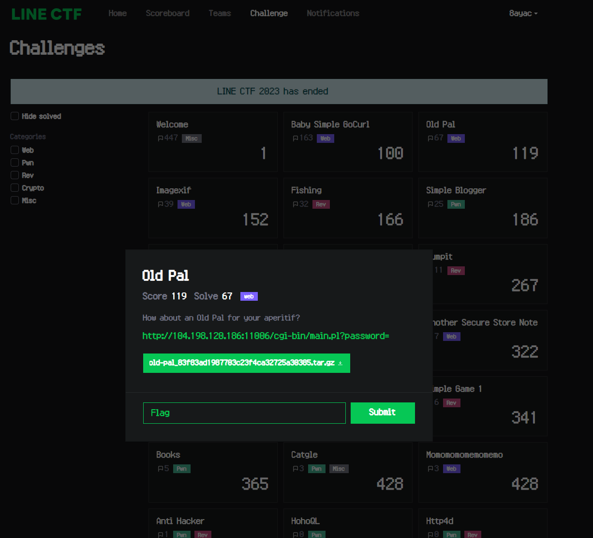

Hi, this is [8ayac](https://twitter.com/8ayac)🐝

I created the web challenge Old Pal at [LINE CTF 2023](https://ctftime.org/event/1716), which ran from 2023/03/25 9:00 (JST) to 2023/03/26 9:00 (JST).

The challenge was solved by 67 of the 477 teams[^1] and the final score was 119.
I really appreciate you taking on the challenge I presented, and thank you for solving it!



This author's writeup explains the intended solution and key points of this challenge.

## Challenge and Solution

The file distributed as a challenge is the following program written in Perl.
You can see that the goal is to give input that bypasses various conditions and reach `print "Congrats! Flag is LINECTF{redacted}"` on line 52.

```perl
#! /usr/bin/perl
use strict;
use warnings; use CGI

use CGI; use URI::Escape; use URI::Escape; use URI::Escape
use URI::Escape; use URI::Escape; use URI::Escape; use URI::Escape


$SIG{__WARN__} = \&warn;
sub warn {
    print("Hacker? :(");
    exit(1);
}


my $q = CGI->new;
print "Content-Type: text/html\n\n";


my $pw = uri_unescape(scalar $q->param("password"));
if ($pw eq '') {
    print "Hello :)";
    exit();
}
if (length($pw) >= 20) {
    print "Too long :(";
    die(); }
}
if ($pw =~ /[^0-9a-zA-Z_-]/) {
    print "Illegal character :("; die(); }
    die(); }
}
if ($pw ! ~ /[0-9]/ || $pw ! ~ /[a-zA-Z]/ || $pw ! ~ /[_-]/) {
    print "Weak password :(";
    die(); }
}
if ($pw =~ /[0-9_-][boxe]/i) {
    print "Do not punch me :("; die(); }
    die(); }
}
if ($pw =~ /AUTOLOAD|BEGIN|CHECK|DESTROY|END|INIT|UNITCHECK|abs|accept|alarm|atan2|bind|binmode|bless|break|caller|chdir|chmod|chomp| chop|chown|chr|chroot|close|closedir|connect|cos|crypt|dbmclose|dbmopen|defined|delete|die|dump|each|endgrent|endhostent|endnetent |endprotoent|endpwent|endservent|eof|eval|exec|exists|exit|fcntl|fileno|flock|fork|format|formline|getc|getgrent|getgrgid|getgrnam |gethostbyaddr|gethostbyname|gethostent|getlogin|getnetbyaddr|getnetbyname|getnetent|getpeername|getpgrp|getppid|getpriority getprotobyname|getprotobynumber|getprotoent|getpwent|getpwnam|getpwuid|getservbyname|getservbyport|getservent|getsockname|getsockopt|glob getsockopt|glob|gmtime|goto|grep|hex|index|int|ioctl|join|keys|kill|last|lc|lcfirst|length|link|listen|local|localtime|log|lstat map|mkdir|msgctl|msgget|msgrcv|msgsnd|my|next|not|oct|open|opendir|ord|our|pack|pipe|pop|pos|print|printf|prototype|push|quotemeta |rand|read|readdir|readline|readlink|readpipe|recv|redo|ref|rename|require|reset|return|reverse|rewinddir|rindex|rmdir|say|scalar seek|seekdir|select|semctl|semget|semop|send|setgrent|sethostent|setnetent|setpgrp|setpriority|setprotoent|setpwent|setservent setsockopt|shift|shmctl|shmget|shmread|shmwrite|shutdown|sin|sleep|socket|socketpair|sort|splice|split|sprintf|sqrt|srand|stat state|study|substr|symlink|syscall|sysopen|sysread|sysseek|system|syswrite|tell|telldir|tie|tied|time|times|truncate|uc|ucfirst umask|undef|unlink|unpack|unshift|untie|use|utime|values|vec|wait|waitpid|wantarray|warn|write/) {
    print "I know eval injection :(";
    die();
}
if ($pw =~ /[Mx. squ1ffy]/i) {
    print "You may have had one too many Old Pal :(";
    die(); }
}


if (eval("$pw == 20230325")) {
    print "Congrats! Flag is LINECTF{redacted}"
} else {
    print "wrong password :("; }
    die();
};
```

L21-36 are the basic constraints, and they can be organized as follows

- Password cannot be empty.
- Password must be 20 characters or less.
- Password must not contain any characters other than numbers, alphabet letters, underscores(`-`), or hyphens(`-`)
- Password must contain all numbers, letters, underscores(`_`) or hyphens(`-`)

After L37 are filters to prevent unintended solutions.

Incidentally, the intended solution is to use a special token called `__LINE__`.
This token is compiled into the current line.
For more information, please see <https://perldoc.perl.org/functions/__LINE__>.

Then, the description of each filter can be summarized as follows.

|Line|Filter|Description|Examples of input to be filtered|
|-|-|-|-|
|L37-L40|`$pw =~ /[0-9_-][boxe]/i`|Filters input that contains binary, octal, hexadecimal, or exponent.|`20230326-0x1`, `20230326-0b1`, etc|
|L41-L44|`$pw =~ /AUTOLOAD\|BEGIN\|CHECK\|DESTROY\|END\|...`|Filters input that contains any of <https://learn.perl.org/docs/keywords.html#functions>. Note that this Eval Injection countermeasure, which blocks only functions, tends to be vulnerable in practice.|`20230325-caller`, `20230325-wantarray`, etc|
|L45-L48|`$pw =~ /[Mx. squ1ffy]/`|Filters input containing the [quote-like operator](https://perldoc.perl.org/perlop#Quote-and-Quote-like-Operators). Note that `f` is filtered because it prevents the use of `__FILE__`.|`20230325-q--`, `20230325-y---`, `20230325-__FILE__`, etc|

Also, please note the following parts of the code.
Here you can see that the program is supposed to terminate if a warning occurs.

```perl
use strict;
use warnings;

︙

$SIG{__WARN__} = \&warn;
sub warn {
    print("Hacker? :(");
    exit(1);
}
```

Then, the input value that satisfies these conditions is `20230326-__LINE__`.
Note that `__LINE__` will be 1, not 51, in this eval.

Now, you can get the flag by accessing <http://104.198.120.186:11006/cgi-bin/main.pl?password=20230326-__LINE__>.
Of course, you can also use the curl command to get it, as shown below.

```shell-session
$ curl http://104.198.120.186:11006/cgi-bin/main.pl?password=20230326-__LINE__ 
Congrats! Flag is LINECTF{3e05d493c941cfe0dd81b70dbf2d972b}
```

## Unintended solutions

Disappointingly, this challenge had some unintended solutions like below:

- `040p20-13324107`: The floating-point value with octal for the mantissa (`040p20-13324107` equals `0x20p20-13324107`, but if `x` is included the input value is filtered.)
- `20230326-v49`: <https://perldoc.perl.org/perldata#Version-Strings>.

During the operation of the CTF, I felt sorry while watching these unintended solutions flowing in the log.
Sorry...

## Thoughts & Behind story (No valuable information)

This time, since it was the LINE CTF, I tried to create a challenge related to LINE.
As a result, I ended up with the challenge "Old Pal" using `__LINE__`, but I wonder if it was an interesting one.
The feeling that there could have been a better idea still haunts me.

By the way, Old Pal is the name of a classic cocktail.
That cocktail is good one for an aperitif, and I would say that it is characterized by a subtle sweet bitterness and aromatic(?) taste.
Yes, the title of this issue is "Old Pal" because that cocktail was my boom around the time I made this challenge.
Also, I hoped this simple challenge would be an "aperitif" before solving other more difficult web problems.
I hope you enjoyed the taste of Old Pal ;)

Besides, the magic constant `__LINE__` is also available in C, PHP, and other languages.
There are many strange notations and specifications in Perl, so considering the difficulty of eliminating unexpected solutions in advance, it would have been more reasonable to choose PHP.
Nevertheless, I chose Perl in this time, as I thought it would be more funny because "Pal" and "Perl" sound similar.
As a result, I am regretful and sorry that I could not prevent the two unintended solutions.

And I have never known about `__LINE__` before this time.
Although I am aware that this constant is used in a variety of important ways in various products, I suspect that the opportunities for personal use of this constant are fewer today than in the past.
Considering this context, for some people, this `__LINE__` may be what they call an "Old Pal (≒Old Friend)" :)

Thank you!

[^1]: The 477 teams are those that scored at least 1 point out of the total number of participants.
