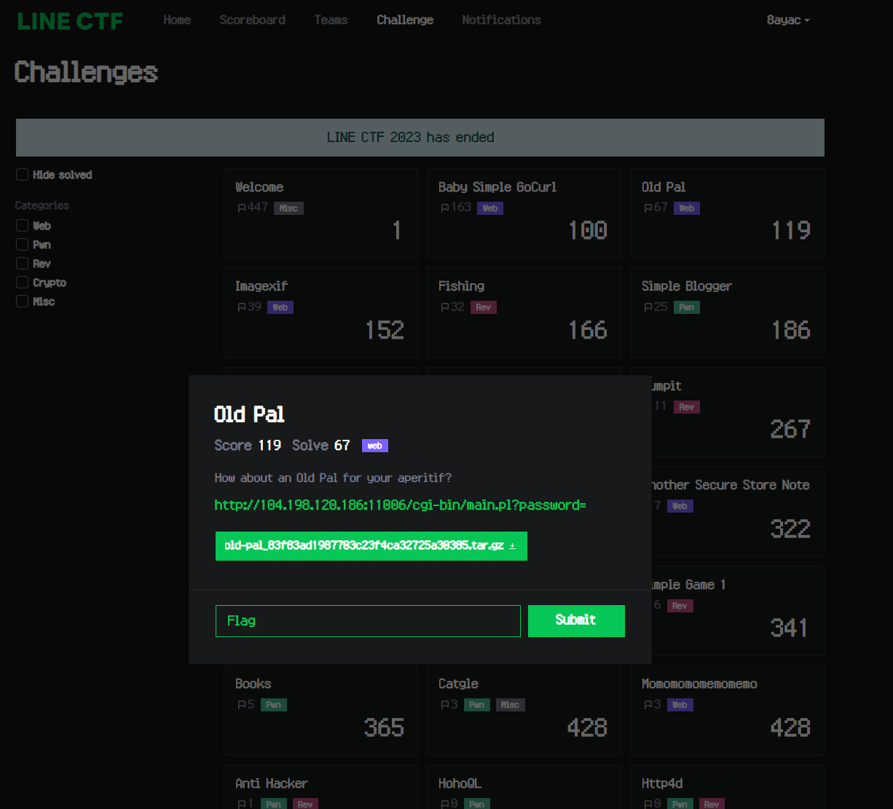

こんにちは、[8ayac](https://twitter.com/8ayac)です🐝

2023/03/25 9:00(JST)から2023/03/26 9:00(JST)に行われた[LINE CTF 2023](https://ctftime.org/event/1716)において、Web問のOld Palを作りました。

この問題は、477チーム[^1]中67名によって解かれ、最終的なスコアは119点でした。
皆さんありがとうございます！



さて、この記事では、この問題の想定解法やポイントについて説明します。

## 問題と解法

問題として配布したファイルは、下記のPerlで書かれたプログラムです。
様々な条件を回避する入力を与え、52行目の`print "Congrats! Flag is LINECTF{redacted}"`に到達することがゴールだとわかります。

```perl
#!/usr/bin/perl
use strict;
use warnings;

use CGI;
use URI::Escape;


$SIG{__WARN__} = \&warn;
sub warn {
    print("Hacker? :(");
    exit(1);
}


my $q = CGI->new;
print "Content-Type: text/html\n\n";


my $pw = uri_unescape(scalar $q->param("password"));
if ($pw eq '') {
    print "Hello :)";
    exit();
}
if (length($pw) >= 20) {
    print "Too long :(";
    die();
}
if ($pw =~ /[^0-9a-zA-Z_-]/) {
    print "Illegal character :(";
    die();
}
if ($pw !~ /[0-9]/ || $pw !~ /[a-zA-Z]/ || $pw !~ /[_-]/) {
    print "Weak password :(";
    die();
}
if ($pw =~ /[0-9_-][boxe]/i) {
    print "Do not punch me :(";
    die();
}
if ($pw =~ /AUTOLOAD|BEGIN|CHECK|DESTROY|END|INIT|UNITCHECK|abs|accept|alarm|atan2|bind|binmode|bless|break|caller|chdir|chmod|chomp|chop|chown|chr|chroot|close|closedir|connect|cos|crypt|dbmclose|dbmopen|defined|delete|die|dump|each|endgrent|endhostent|endnetent|endprotoent|endpwent|endservent|eof|eval|exec|exists|exit|fcntl|fileno|flock|fork|format|formline|getc|getgrent|getgrgid|getgrnam|gethostbyaddr|gethostbyname|gethostent|getlogin|getnetbyaddr|getnetbyname|getnetent|getpeername|getpgrp|getppid|getpriority|getprotobyname|getprotobynumber|getprotoent|getpwent|getpwnam|getpwuid|getservbyname|getservbyport|getservent|getsockname|getsockopt|glob|gmtime|goto|grep|hex|index|int|ioctl|join|keys|kill|last|lc|lcfirst|length|link|listen|local|localtime|log|lstat|map|mkdir|msgctl|msgget|msgrcv|msgsnd|my|next|not|oct|open|opendir|ord|our|pack|pipe|pop|pos|print|printf|prototype|push|quotemeta|rand|read|readdir|readline|readlink|readpipe|recv|redo|ref|rename|require|reset|return|reverse|rewinddir|rindex|rmdir|say|scalar|seek|seekdir|select|semctl|semget|semop|send|setgrent|sethostent|setnetent|setpgrp|setpriority|setprotoent|setpwent|setservent|setsockopt|shift|shmctl|shmget|shmread|shmwrite|shutdown|sin|sleep|socket|socketpair|sort|splice|split|sprintf|sqrt|srand|stat|state|study|substr|symlink|syscall|sysopen|sysread|sysseek|system|syswrite|tell|telldir|tie|tied|time|times|truncate|uc|ucfirst|umask|undef|unlink|unpack|unshift|untie|use|utime|values|vec|wait|waitpid|wantarray|warn|write/) {
    print "I know eval injection :(";
    die();
}
if ($pw =~ /[Mx. squ1ffy]/i) {
    print "You may have had one too many Old Pal :(";
    die();
}


if (eval("$pw == 20230325")) {
    print "Congrats! Flag is LINECTF{redacted}"
} else {
    print "wrong password :(";
    die();
};
```

21行目から36行目までが基本的な制約で、これらは下記のように整理できます。

- パスワードは空ではない
- パスワードは20文字以下であること
- パスワードは数字、英字、アンダースコア、ハイフン以外の文字が含まれていないこと
- パスワードは数字、英字、アンダースコアまたはハイフンのいずれかがすべて含まれていること

37行目以降は、想定解以外を防ぐためのフィルターです。

なお、想定解は`__LINE__`という特別なトークンを使うものです。
このトークンは、現在の行を示す値にコンパイルされます。
詳しくは、<https://perldoc.perl.org/functions/__LINE__>をご覧ください。

そして、各フィルターについては、下記のようにまとめられます。

|行数|フィルター|説明|フィルターされる文字列の例|
|-|-|-|-|
|L37-L40|`$pw =~ /[0-9_-][boxe]/i`|2進数、8進数、16進数、指数を使うものをフィルターします。|`20230326-0x1`, `20230326-0b1`など|
|L41-L44|`$pw =~ /AUTOLOAD\|BEGIN\|CHECK\|DESTROY\|END\|...`|<https://learn.perl.org/docs/keywords.html#functions>のいずれかが含まれる入力をフィルターします。なお、このように特定の関数だけを防ぐEval Injection対策は、実際には脆弱性に繋がりやすいです。|`20230325-caller`, `20230325-wantarray`など|
|L45-L48|`$pw =~ /[Mx. squ1ffy]/`|[quote-like演算子](https://perldoc.perl.org/perlop#Quote-and-Quote-like-Operators)を含む入力をフィルターします。なお`f`がフィルター対象とされているのは、`__FILE__`を使用できないようにするためです。|`20230325-q--`, `20230325-y---`, `20230325-__FILE__`など|

また、コードの下記の部分に注目してください。
この部分から、警告が起こった場合はプログラムが終了するようになっていることがわかります。

```perl
use strict;
use warnings;

︙

$SIG{__WARN__} = \&warn;
sub warn {
    print("Hacker? :(");
    exit(1);
}
```

したがって、L51のevalによって評価されるプログラムは警告を出さないように注意しなければなりません。

そして、これらの条件を満たす入力値が、`20230326-__LINE__`となるわけです。
このときeval内では`__LINE__`が51ではなく1になることに注意してください。

あとは、<http://104.198.120.186:11006/cgi-bin/main.pl?password=20230326-__LINE__>にアクセスすれば、Flagが入手できます。
もちろん下記のようにcurlコマンドで取ってきても良いです。

```shell-session
$ curl http://104.198.120.186:11006/cgi-bin/main.pl?password=20230326-__LINE__ 
Congrats! Flag is LINECTF{3e05d493c941cfe0dd81b70dbf2d972b}
```


## 非想定解

残念ながら、この問題には下記のような非想定解がありました。

- `040p20-13324107`: 仮数部が8進数表記の浮動小数点数を利用しています。(`040p20-13324107`=`0x20p20-13324107`ですが、`x`が含まれる場合、入力値はフィルターされます。)
- `20230326-v49`: <https://perldoc.perl.org/perldata#Version-Strings>を利用しています。

運営中、このような非想定解がログに流れているのを見ながら、申し訳ない気持ちになっていました。
すみません...


## 感想と裏話(有益な情報はありません)

今回はLINE CTFなのでLINEにかけた問題を作成してみたかったです。
結果として、`__LINE__`を使った問題になりましたが、面白かったでしょうか。
もっと良い形での出題があったのではないかという思いが、今でも頭を離れません。

ところで、Old Palというカクテルがあります。
そのカクテルは食前酒向きのもので、優しい甘苦さと香り高さが特徴と言えると思います。
作問を進めている時期に、このカクテルにハマっていて、問題のタイトルにしました。
このシンプルな問題は、他の難易度の高いWeb問題を解く前の「食前酒」にピッタリだったのではないでしょうか。
結果として、その味わいもOld Palのようなものになっていたら最高です(?)

ポエムはさておき、`__LINE__`というマジック定数はCやPHPなどにも備わっています。
Perlの記法や仕様には不思議なものが多く、非想定解を事前に潰しきる苦労を考慮すれば、PHPを選ぶ方が合理的だったかもしれません。
であるにも関わらず、今回のようにPerlで出題することになったのは、タイトルに含まれる「Pal」と「Perl」の音が似ていて「面白いのでは？」と思ってしまったためです。
結果として、2つの非想定解が防げなかったのは悔しいですし、申し訳ないと思っています。
ごめんなさい。

そして、私は今回作問するにあたり、この`__LINE__`について初めて知ることになりました。
この定数が、様々なプロダクトで重要な使われ方をしていることは承知していますが、現代ではこの定数を個人的に使用する機会は過去と比べて減ったのではないかと推測しています。
このような背景を考えれば、一部の人にとってはこの`__LINE__`が「Old Pal(≒Old Friend)」と呼ぶにふさわしいものかもしれませんね。
(え?)

お後がよろしいようで。

[^1]: 参加チーム総数のうち、1点以上得点したチームの数が477でした。